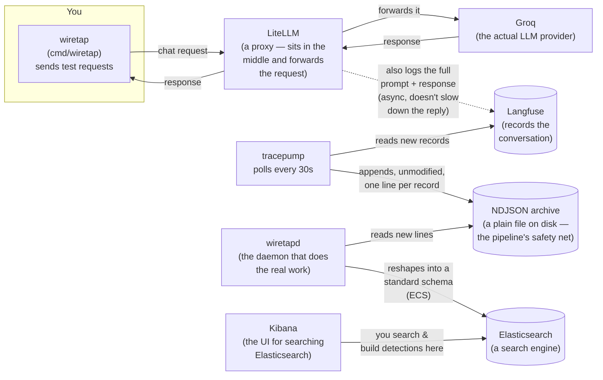

# wiretap

wiretap is a small, disposable lab for practicing one specific skill:
**catching attacks against an AI chatbot by watching what it says, not just
who's allowed to talk to it.**

If you've never worked with this kind of system before, here's the plain
version: a "large language model" (LLM) is the AI system behind chatbots
like the one powering customer support bots or coding assistants — you send
it text, it sends text back. People try to trick these systems the same way
they try to trick a person: by pretending to be someone else, by hiding
instructions inside an innocent-looking message, or by asking the same
question worded differently until something slips. This is called **prompt
injection**, and it's a real, growing category of attack. wiretap builds a
small real pipeline, deliberately attacks it with known techniques, and
shows exactly how to build detection rules that catch them — using data
you can inspect at every step, because you already know which requests were
attacks and which weren't.

## Why this exists

If you were setting up security monitoring for a real LLM-powered product,
you'd want to answer questions like "did anyone try to extract our system
prompt today?" or "which user is burning through 10x the normal token
budget?" — the same way a SOC (security operations center) answers "did
anyone try to brute-force a login today?" for traditional infrastructure.
The hard part isn't writing a search query; it's not knowing, for certain,
whether your query actually catches what you think it catches, because in
production you rarely know the ground truth of what really happened.

wiretap solves that by fabricating the ground truth on purpose. It fires
three kinds of test request — an ordinary question, a prompt-injection
attempt, and a request forced to cut off mid-answer — at a real (but
disposable) LLM, tags each one with which kind it is, and carries that label
all the way through the pipeline into Elasticsearch, quarantined so it can
never leak into a field a detection would query. That lets you write a
detection, run it, and know immediately whether it caught the right
requests — see [docs/DETECTIONS.md](docs/DETECTIONS.md) for the actual
detections this lab supports today.

## Architecture



Every one of those pieces is explained in more depth, including *why* it's
built the way it is, in [arch.md](arch.md).

## Quickstart

You'll need Docker and Go installed. Everything else runs in containers.

```bash
# 1. Copy the example environment file and fill in real values.
#    See the comments in .env.example for what each one is for.
cp .env.example .env

# 2. Bring the whole stack up.
docker compose up -d

# 3. Confirm everything's actually working before doing anything else.
#    (See RUNBOOK.md if any of these fail.)
go run ./cmd/wiretapd check

# 4. Create the Elasticsearch index wiretapd will write into.
go run ./cmd/wiretapd bootstrap

# 5. Fire the three test scenarios (benign / injection / truncated).
go run ./cmd/wiretap

# 6. Wait ~30s for tracepump to fetch them from Langfuse and wiretapd to
#    index them (both run continuously as containers), then check:
go run ./cmd/wiretapd check
```

From here, open Kibana at http://localhost:5601 and start querying the
`wiretap-llm-events` index — or jump straight to
[docs/DETECTIONS.md](docs/DETECTIONS.md) for ready-made detection queries to
try first.

For anything that goes wrong along the way, [RUNBOOK.md](RUNBOOK.md) is the
troubleshooting reference — it's written to be the first thing you open when
something's broken, not the last.

## What's in this repo

| Path | What it is |
|---|---|
| `cmd/wiretap/` | Fires the three test scenarios at LiteLLM (was `main.go` at the repo root; see [scenarios.json](scenarios.json) for what each scenario actually sends) |
| `cmd/tracepump/` | Polls Langfuse and appends new records, byte-for-byte and unmodified, to the NDJSON archive |
| `cmd/tracescope/` | A debugging tool: fetches and pretty-prints one Langfuse trace by ID |
| `cmd/wiretapd/` | The ingestion daemon — `bootstrap` / `run` / `backfill` / `check` (see `go run ./cmd/wiretapd -h`-equivalent: each subcommand's flags are documented at the top of its own file in `cmd/wiretapd/`) |
| `internal/langfuse/` | The one HTTP client for Langfuse's API, shared by tracepump, tracescope, and wiretapd |
| `internal/model/` | `LLMEvent`, the source-agnostic shape every parser produces and every mapper reads — see arch.md for why this indirection exists |
| `internal/parse/` | Turns one raw Langfuse record into an `LLMEvent` |
| `internal/ecs/` | Turns an `LLMEvent` into an ECS-shaped document, ready for Elasticsearch — the only place a `gen_ai.*` or `llm.*` field name is decided |
| `internal/esink/` | Bulk-indexes documents into Elasticsearch and creates its index template |
| `internal/pipeline/` | Wires `internal/langfuse` → `internal/parse` → `internal/ecs` → `internal/esink` together — the `Fetcher` and `Indexer` that `cmd/wiretapd` runs |
| `docker-compose.yml` | The whole stack: LiteLLM, Langfuse (and its dependencies), Elasticsearch, Kibana, tracepump, wiretapd |
| `docs/reference/ecs-gen_ai.md` | Elastic's own Gen AI field reference, saved locally — `internal/ecs` is checked against this file field-by-field |
| `docs/DETECTIONS.md` | The payoff: real detection queries, what they depend on, and what's still missing |
| `arch.md` | The design decisions behind this pipeline, and why |
| `notes.md` | Field-by-field detection-engineering notes, plus two real incidents this project ran into and how they were fixed |
| `RUNBOOK.md` | Startup order, port reference, and troubleshooting |

## A note on scope

This lab currently only sees one side of the story: the *content* of each
request (what was said), via Langfuse. It doesn't yet see the *gateway*
side (who called, what quota they had, what got blocked) from LiteLLM's own
logs. That's a deliberate, tracked gap — see arch.md's "two log sources"
section and docs/DETECTIONS.md's "needs the gateway source" markers for
exactly what that would unlock.
