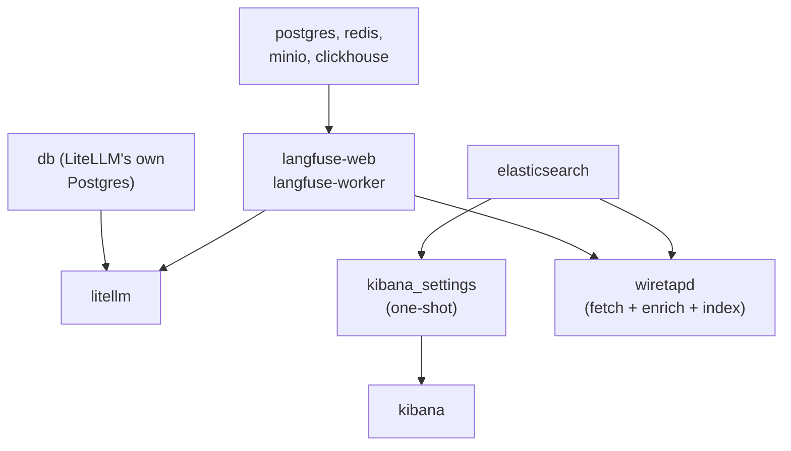

# RUNBOOK

This is the operational guide: how to start the stack, how to tell it's
actually working, and what to do when it isn't. If something's broken and
you're not sure where to start, start with the next section.

## If something's wrong, run this first

```bash
go run ./cmd/wiretapd check
```

This prints a pass/fail table for the four things most likely to be broken:
can it reach Langfuse (the service that records what the AI said), can it
reach Elasticsearch (the search engine everything ends up in), does the
Elasticsearch index template exist yet (see step 5 below), and is the
shared data file actually there and non-empty. Every troubleshooting
section below corresponds to one row of this table failing.

## 1. Configure `.env`

```bash
cp .env.example .env
```

Fill in every value in `.env` (see the group comments in `.env.example` for
what each one is for), including `KIBANA_ENCRYPTION_KEY`, generated with
`openssl rand -hex 32` (or similar).

## 2. Bring the stack up

```bash
docker compose up -d
```

This starts everything at once; Docker Compose figures out the order on
its own from each service's declared dependencies. Roughly:



## 3. Verify each service is healthy

```bash
docker compose ps
```

Expected `STATUS` column:

| Service | Expected status |
|---|---|
| `litellm` | `Up (healthy)` |
| `db` | `Up (healthy)` |
| `prometheus` | `Up` (no healthcheck defined) |
| `langfuse-web` | `Up` (no healthcheck defined) |
| `langfuse-worker` | `Up` (no healthcheck defined) |
| `clickhouse` | `Up (healthy)` |
| `minio` | `Up (healthy)` |
| `redis` | `Up (healthy)` |
| `postgres` | `Up (healthy)` |
| `elasticsearch` | `Up (healthy)` |
| `kibana_settings` | `Exited (0)` -- this is a one-shot bootstrap job, not a long-running service |
| `kibana` | `Up (healthy)` |
| `wiretapd-init` | `Exited (0)` -- one-shot; fixes ownership of both the `tracepump_data` (archive) and `wiretapd_state` volumes before `wiretapd` starts |
| `wiretapd` | `Up` (no healthcheck; see below) |

For any service reporting `unhealthy`, get details with:

```bash
docker inspect --format='{{json .State.Health}}' <container-name> | python3 -m json.tool
```

`wiretapd` has no Docker healthcheck -- it's a background poller, not an
HTTP service with a port to probe. Confirm it's actually working by
tailing its logs:

```bash
docker compose logs -f wiretapd
```

`wiretapd` prints structured JSON lines on two independent cycles: a fetch
cycle (every 30s by default) logging `"msg":"fetch poll ok"` with `emitted`
and `skipped` counts, immediately followed by `"msg":"enrichment counters"`
with `attempted`/`succeeded`/`skipped`/`failed` counts for that poll's
per-trace detail fetches (see "Enrichment failures" below for what a
non-zero `skipped` or `failed` here means); and an index cycle (every 10s
by default) logging `"msg":"index pass ok"` with counts of how many
archive lines it read, parsed, and queued for Elasticsearch. Errors from
either cycle are logged, not silent.

## 4. Bootstrap the Elasticsearch index

Elasticsearch needs to be told, in advance, the shape of the data it's
about to receive (which fields exist, and what type each one is) -- this
is called a **mapping**, and getting it right matters (see `arch.md`'s
section on the `wildcard` field type for a concrete example of what goes
wrong if it's skipped). This one-time step creates that mapping:

```bash
go run ./cmd/wiretapd bootstrap
```

Safe to run more than once -- it's a plain overwrite of the same
definition, not an error, if the index already exists.

## 5. Generate some test data and confirm it flows through

```bash
go run ./cmd/wiretap
go run ./cmd/wiretapd check
```

`wiretapd check`'s fourth row should now show the archive as non-empty. Give
it another 30-60 seconds (one `wiretapd` fetch cycle plus one index cycle)
and query Elasticsearch directly to confirm documents actually arrived:

```bash
source .env
curl -s -u "elastic:$ELASTIC_PASSWORD" http://localhost:9200/wiretap-llm-events/_count
```

## Updating field mappings after a code change

Elasticsearch needs to be told the shape of the data it's about to receive
*before* that data arrives (see step 4 above) -- this is called a
**mapping**. Whenever `internal/esink`'s mapping code changes (a new field,
or a field's type changes), **that change does not apply retroactively to
an index that already exists.** `wiretapd bootstrap` updates the
*template* Elasticsearch will use for the *next* index it creates, but the
current index -- already created, from the old template -- keeps its old
mapping regardless of how many times you re-run `bootstrap`. Running
`bootstrap` again and assuming the mapping is now fixed is the single most
common way to conclude this pipeline is broken when it isn't.

There are two ways out. For this lab, the first is almost always the right
one -- it's exactly why the NDJSON archive exists (see `arch.md`):

### Recreate the index and replay the archive (recommended)

```bash
source .env

# 1. Delete the old, wrongly-mapped concrete index. (The alias
#    wiretap-llm-events briefly points at nothing -- fine for a lab; don't
#    do this against something else actively querying it at the same time.)
curl -s -u "elastic:$ELASTIC_PASSWORD" -X DELETE http://localhost:9200/wiretap-llm-events-000001

# 2. Recreate it from the (already-updated) template. Bootstrap skips
#    creating the index if one already exists -- step 1 is what makes this
#    actually create a fresh one instead of silently doing nothing.
go run ./cmd/wiretapd bootstrap   # or: docker compose run --rm wiretapd bootstrap

# 3. Replay the entire archive through the corrected mapping. This is not
#    a re-fetch from Langfuse -- the archive already has everything;
#    backfill just re-reads and re-indexes it. Safe to run any time,
#    because indexing is _id-keyed (see arch.md): nothing is duplicated.
go run ./cmd/wiretapd backfill   # or: docker compose run --rm wiretapd backfill
```

Confirm the new mapping actually took effect:

```bash
curl -s -u "elastic:$ELASTIC_PASSWORD" http://localhost:9200/wiretap-llm-events/_mapping | python3 -m json.tool
```

### Add just the new field to the existing index (advanced, narrower)

If recreating the index isn't an option (you have data in it that isn't
in the archive and can't be regenerated), Elasticsearch does allow adding
a **brand-new** field to an existing index's mapping without recreating
it -- but only if no document has been indexed with that field yet. If
even one document already reached the index with the field left to
dynamic mapping (Elasticsearch guesses a type itself, e.g. `long` instead
of the `integer` this project's mapping intends), trying to correct it
afterward fails with a mapper conflict, and recreating the index becomes
the only way out anyway. Add the field explicitly, before any document
carrying it is indexed:

```bash
curl -s -u "elastic:$ELASTIC_PASSWORD" -X PUT http://localhost:9200/wiretap-llm-events/_mapping \
  -H "Content-Type: application/json" \
  -d '{"properties": {"llm": {"properties": {"generation_count": {"type": "integer"}}}}}'
```

This does not work for a field whose *type* changed -- only for a field
that's genuinely new to the index.

## Port reference

Every host port this compose file claims, all bound to `127.0.0.1` only:

| Port | Service | Purpose |
|---|---|---|
| 3000 | `langfuse-web` | Langfuse UI / API |
| 3030 | `langfuse-worker` | Langfuse background worker |
| 4000 | `litellm` | LiteLLM proxy (chat completions API) |
| 5432 | `postgres` | Langfuse's Postgres |
| 5433 | `db` | LiteLLM's own Postgres (remapped from 5432, which Langfuse's Postgres holds) |
| 5601 | `kibana` | Kibana UI |
| 6379 | `redis` | Langfuse's Redis |
| 8123 | `clickhouse` | ClickHouse HTTP interface |
| 9000 | `clickhouse` | ClickHouse native protocol |
| 9090 | `minio` | MinIO S3 API (remapped from 9000, which ClickHouse holds) |
| 9091 | `minio` | MinIO console |
| 9092 | `prometheus` | Prometheus UI (remapped from 9090, which MinIO holds) |
| 9200 | `elasticsearch` | Elasticsearch HTTP API |

`wiretapd` publishes no host port.

## Troubleshooting

### `wiretapd check` reports "langfuse reachable: FAIL"

Symptoms: a connection-refused or timeout error, or a 401.

- **Connection refused / timeout:** `langfuse-web` isn't up yet or isn't
  healthy. Check `docker compose ps langfuse-web` and its logs first.
- **401 Unauthorized:** `LANGFUSE_PUBLIC_KEY` / `LANGFUSE_SECRET_KEY` in
  `.env` don't belong to an actual Langfuse project. Create one via the
  Langfuse UI at http://localhost:3000 if you haven't, or via the
  `LANGFUSE_INIT_PROJECT_*` bootstrap variables. If you're relying on
  `LANGFUSE_INIT_PROJECT_PUBLIC_KEY`/`SECRET_KEY` to seed the project on
  first boot, remember those only take effect on Langfuse's *first ever*
  startup against an empty Postgres database -- changing them after the
  fact does nothing. Confirm directly:
  ```bash
  curl -u "$LANGFUSE_PUBLIC_KEY:$LANGFUSE_SECRET_KEY" http://localhost:3000/api/public/traces?limit=1
  ```

### `wiretapd check` reports "elasticsearch reachable: FAIL"

- **Connection refused:** `elasticsearch` isn't up yet or isn't healthy --
  check `docker compose ps elasticsearch` and its logs.
- **401 Unauthorized:** `ELASTIC_PASSWORD` in `.env` doesn't match what
  Elasticsearch actually has. See "Elasticsearch stuck `unhealthy`" below
  -- the same root cause (a password baked in at first boot) applies here
  even once the container reports healthy.
- **Running `wiretapd` from the host, not as a container:** double-check
  you haven't accidentally set `ELASTICSEARCH_URL` to the in-container
  hostname (`http://elasticsearch:9200`) -- that only resolves *inside*
  Docker's network. From the host, it's `http://localhost:9200`.

### Elasticsearch stuck `unhealthy` after running `docker compose up -d` with `ELASTIC_PASSWORD` blank

This happens if you brought the stack up before filling in `.env` (skipping
step 1 above). Elasticsearch only applies `ELASTIC_PASSWORD` when it first
bootstraps its security realm on that volume -- **filling in `.env` after the
fact does not retroactively change it**, because the `elastic` user's
password is already fixed in `elasticsearch_data`. Recreating the container
alone won't help either. Two ways out:

- **Reset in place (keeps any indexed data):**
  ```bash
  docker exec elasticsearch /usr/share/elasticsearch/bin/elasticsearch-reset-password -u elastic -a -f -b
  ```
  This prints a new password to stdout -- copy it into `.env` as
  `ELASTIC_PASSWORD` (it will not match whatever you originally wrote there),
  then `docker compose up -d` again so the healthcheck picks up the new value.
- **Start over (fine if the volume has nothing worth keeping yet):**
  ```bash
  docker compose down elasticsearch
  docker volume rm wiretap_elasticsearch_data
  docker compose up -d elasticsearch
  ```
  With `ELASTIC_PASSWORD` already correct in `.env` at this point, it bootstraps clean.

### `wiretapd` logs show bulk partial failures, or a growing `dead-letter.json`

Elasticsearch's bulk-index API is unusual: a request can come back with a
normal-looking success status even when some of the documents inside it
failed. `wiretapd` always checks each document's individual result, not
just the overall response -- so if you see this, it's real, not a
false alarm.

- **The failure was retryable** (Elasticsearch was briefly overloaded or
  rate-limiting): `wiretapd` retries these automatically with backoff --
  you'll see a `"retried"` count go up in its periodic counters log, and
  usually nothing further to do.
- **The failure was permanent** (a document's shape didn't match the
  index's mapping): it lands in `dead-letter.json` (inside the
  `wiretapd_state` volume) with the full Elasticsearch error attached, and
  is *not* retried in a loop. Inspect it:
  ```bash
  docker run --rm -v wiretap_wiretapd_state:/state alpine \
    cat /state/dead-letter.json
  ```
  Each line is one failed document plus the reason. A mapping error here
  usually means `internal/ecs`'s output shape and `internal/esink`'s index
  mapping have drifted apart -- check `internal/esink/bootstrap.go`'s
  `indexMapping()` against whatever field the error names.

### Kibana / a query returns zero results, but you expected data

Work through this in order:

1. **Is there actually anything to find?**
   ```bash
   source .env
   curl -s -u "elastic:$ELASTIC_PASSWORD" http://localhost:9200/wiretap-llm-events/_count
   ```
   If this is `0`, the problem is upstream of Elasticsearch entirely --
   check `wiretapd check`'s "archive readable and non-empty" row, and that
   `go run ./cmd/wiretap` has actually been run recently.
2. **Does the index exist at all?** If the count query itself 404s, you
   skipped step 4 (bootstrap) above.
3. **Is your query using the right field name and type?** A `wildcard`
   query against a `keyword` or `text` field (or vice versa) can silently
   return nothing instead of erroring -- see `arch.md`'s section on the
   `wildcard` decision, and confirm the field's actual mapped type:
   ```bash
   curl -s -u "elastic:$ELASTIC_PASSWORD" http://localhost:9200/wiretap-llm-events/_mapping | python3 -m json.tool
   ```

### Documents are present in Elasticsearch, but a field you expect is missing or empty

Most of the time this is correct, not a bug. Two different categories:

- **`gen_ai.response.finish_reasons` (or anything like it) -- not just
  missing on this document, missing on *every* document, permanently.**
  This one field is genuinely unavailable from this project's Langfuse
  data (Langfuse's observation objects don't carry it under any endpoint
  this project has found) and was removed from `internal/ecs`'s mapper
  entirely rather than left to always emit empty -- see
  `internal/ecs/genai.go`'s package doc and `notes.md` for the full
  reasoning. If you're looking for it in a query or a dashboard, stop --
  it was never going to be there, on any document, ever.
- **`gen_ai.usage.input_tokens`/`output_tokens`, `gen_ai.request.model`,
  `gen_ai.request.max_tokens`, `gen_ai.response.model`,
  `gen_ai.response.id` -- present on some documents, absent on others.**
  These come from Langfuse's *trace detail* endpoint, fetched via this
  project's enrichment step (see `arch.md`'s "Two Langfuse endpoints, one
  archive" section) -- not the list endpoint every trace gets from just
  being polled. A document missing these specific fields either had
  enrichment fail for that one trace (see "Enrichment failures" below --
  check `wiretapd`'s logs around when it was indexed) or was indexed with
  `--no-enrich` set. Either way, this is the pipeline correctly saying "I
  don't have this," not a fabricated zero or empty string standing in for
  it -- see `TestMap_NoGenAIFieldEmittedAsZeroSubstituteForMissing` in
  `internal/ecs`.

If a field you'd expect to *always* be present (like `trace.id` or
`llm.output`) is missing, that's a real bug -- check `wiretapd`'s logs
around the time that document was indexed for a `"skipping unparsable
archive line"` message, which would explain it.

### Enrichment failures (`gen_ai.*` fields missing on specific new documents)

Every fetch poll logs an `"enrichment counters"` line right after
`"fetch poll ok"` (see the log-tailing section above) with
`attempted`/`succeeded`/`skipped`/`failed` counts. `skipped` and `failed`
mean different things and call for different reactions:

- **`skipped` (expected, self-healing, no action needed):** a per-trace
  enrichment attempt hit something transient --
  a 404 (Langfuse's detail endpoint hasn't caught up to a trace that just
  appeared in the list -- see `internal/pipeline/enrich.go`'s
  `enrichTrace` doc comment for why this is a real, expected race, not an
  error), a rate limit, or a network blip. That trace is *not* archived
  this poll and is *not* marked seen, so it comes back around and is
  retried automatically on the next poll (every 30s by default) via the
  same overlap-window mechanism that already covers late-arriving traces.
  You'll see the corresponding trace ID in a `"pipeline: enrichment for
  trace ... deferred to next poll"` line on stderr. A skip count that
  clears to 0 on the very next poll (rather than growing every poll) is
  this working as designed -- do nothing.
- **`failed` (real, action needed):** something systemic broke --
  invalid credentials, a decode error, or an unrecognized HTTP status --
  and the whole poll aborted rather than silently limping through with
  one broken trace after another. You'll see a `"pipeline: enrichment for
  trace ... failed (fatal, aborting poll)"` line, followed by `"fetch poll
  failed"` with the underlying error and a retry backoff. Treat this the
  same as any other `"fetch poll failed"` -- check `LANGFUSE_PUBLIC_KEY`/
  `LANGFUSE_SECRET_KEY` in `.env` first (see "langfuse reachable: FAIL"
  above), since an auth failure on the detail endpoint is the most common
  systemic cause.
- **Rate limiting across a whole page:** if `skipped` is consistently
  high across many polls in a row (not clearing), the enrichment worker
  pool is likely being rate-limited faster than it can catch up --
  `EnrichConcurrency` (default 4, `WIRETAPD_ENRICH_CONCURRENCY` in
  `.env`) may be too aggressive for your Langfuse instance's own limits.
  Lowering it trades throughput for fewer 429s; see
  `internal/pipeline/enrich.go`'s `enrichmentPool` doc comment for how
  the shared pause across workers already coordinates this, and why it's
  not a full token-bucket limiter.
- **A partial page (some traces in a poll enriched, others not):** this
  is normal, not a bug -- `enrichPage` fetches per-trace detail
  concurrently and independently, so one trace's 404 race or rate limit
  never blocks the others on the same page from succeeding. Expect to see
  mixed `succeeded`/`skipped` counts within a single poll when Langfuse's
  detail endpoint is still catching up on some but not all of a batch of
  brand-new traces.

To disable enrichment entirely (accepting that `gen_ai.usage.*` and
friends stay permanently absent, same as before enrichment existed), pass
`--no-enrich` to `wiretapd run`. There's rarely a reason to do this in
this lab -- it exists mainly for cost control against Langfuse instances
with strict rate limits.

## Resetting poisoned trace data

Before `cmd/wiretap` set an explicit `metadata.trace_id` per request,
LiteLLM's Langfuse callback fell back to deriving the trace ID from
`session_id`. Since `session_id` is intentionally shared across a whole
run (and across reruns), every scenario collapsed into one Langfuse trace:
input from one request paired with output from another, tags accumulated
from every outcome, and latency spanning days instead of one request. See
`notes.md` for the full failure mode and why `trace_id` must be unique
while `session_id` must not be.

That historical data is unusable and must be purged -- not silently patched
around -- so no ECS mapping or detection rule ever gets built against it.
**This is destructive and is not automated.** Run each step deliberately.

You can confirm which traces are affected first, without deleting anything,
using `cmd/tracescope`'s merged-trace warnings (added alongside the
`trace_id` fix): fetch a suspect trace ID and see if it prints a `WARNING:`
line for `id` equalling `sessionId`, or for carrying more than one of
`benign`/`injection`/`truncated` in its tags.

### 1. Stop the service that reads and writes the affected file

```bash
docker compose stop wiretapd
```

So nothing is mid-write when the file is removed, and nothing tries to
read a file that's about to disappear out from under it. `wiretapd` is
this stack's only fetcher and only indexer (see `arch.md`'s end-to-end
sequence) -- there's no second service to stop separately.

### 2. Delete the NDJSON archive and both checkpoints

The archive lives in the `tracepump_data` volume (named for this
project's history -- see that volume's own comment in
`docker-compose.yml` -- but written by `wiretapd`, not a separate
`tracepump` service); `wiretapd`'s own fetch and index checkpoints both
live in the separate `wiretapd_state` volume (see `arch.md`'s "why a
plain file sits in the middle" section for why fetch and index keep two
checkpoints, not one). `wiretapd` isn't a shell-having image, so use a
throwaway container against each volume directly:

```bash
docker run --rm -v wiretap_tracepump_data:/data alpine \
  rm -f /data/langfuse-traces.ndjson

docker run --rm -v wiretap_wiretapd_state:/state alpine \
  rm -f /state/wiretapd-index-state.json /state/wiretapd-fetch-state.json
```

Deleting the checkpoints (rather than editing them) is the required step,
not optional cleanup: `wiretapd` treats a missing checkpoint as "nothing
seen/shipped yet" and starts over from the beginning, for both its fetch
and index cycles independently. If you delete the archive but leave
either checkpoint in place, that cycle will believe everything (poisoned
data included) was already handled, and will silently do nothing with
the fresh file.

### 3. Bring the service back up

```bash
docker compose up -d wiretapd
```

With no fetch checkpoint, `wiretapd` does a full resync from Langfuse
(enriching each trace as usual) and repopulates the archive from scratch;
with no index checkpoint, it then re-reads that archive from its own
beginning and re-indexes everything into Elasticsearch. Because
`wiretapd` uses each trace's own ID as the Elasticsearch document ID (see
`arch.md`), this re-indexing safely overwrites anything already there
rather than duplicating it.

### 4. The underlying Langfuse traces themselves

Deleting the archive and both checkpoints does not delete anything from
Langfuse -- the poisoned traces still exist in ClickHouse. You have two
options, and both are valid depending on what you're trying to preserve:

- **Delete them from the Langfuse UI** (http://localhost:3000). This is the
  only way to actually remove them from Langfuse itself.
- **Leave them in place.** `wiretapd` can't distinguish a poisoned trace
  from a good one -- it faithfully re-pulls and re-indexes everything,
  poisoned traces included, on the full resync triggered by step 3. If
  you choose this, you must filter them out yourself (by trace ID, or by
  timestamp if you know the affected window)
  when building detection rules or Kibana data views, since nothing in
  this pipeline will do it for you.

## `docker compose down -v` warning

`-v` deletes every named volume, including data that is expensive or
impossible to regenerate. Before running it, know what you're giving up:

| Volume | Worth keeping? | Why |
|---|---|---|
| `langfuse_postgres_data` | **Yes** | Langfuse's projects, users, API keys, dashboards |
| `langfuse_clickhouse_data` | **Yes** | All Langfuse trace/observation history |
| `langfuse_minio_data` | **Yes** | Blob storage backing large trace payloads referenced by the above |
| `litellm_postgres_data` | **Yes** | LiteLLM's virtual keys, budgets, spend history |
| `tracepump_data` | Usually | The NDJSON archive (named for this project's history; written by `wiretapd`, see that volume's comment in `docker-compose.yml`); losing it means `wiretapd` re-fetches (and re-enriches) Langfuse's full trace history on next boot -- harmless, just slower to catch up |
| `wiretapd_state` | Usually | `wiretapd`'s own fetch and index checkpoints, plus its dead-letter file; losing a checkpoint means that cycle starts over on next boot (harmless -- see the `_id` idempotency note in `arch.md`), but you lose the dead-letter history |
| `langfuse_clickhouse_logs` | No | ClickHouse's own operational logs |
| `langfuse_redis_data` | No | Langfuse's queue/cache, fully disposable |
| `prometheus_data` | No | LiteLLM's Prometheus metrics history, regenerates from new traffic |
| `elasticsearch_data` | Depends | Whatever `wiretapd` has indexed -- keep if you've built detection rules or dashboards against it |
| `kibana_data` | Depends | Kibana's saved objects (data views, dashboards, detection rules) -- keep if you've done that work |

If in doubt, use `docker compose down` (no `-v`) instead -- it stops and
removes containers but leaves every volume intact.
