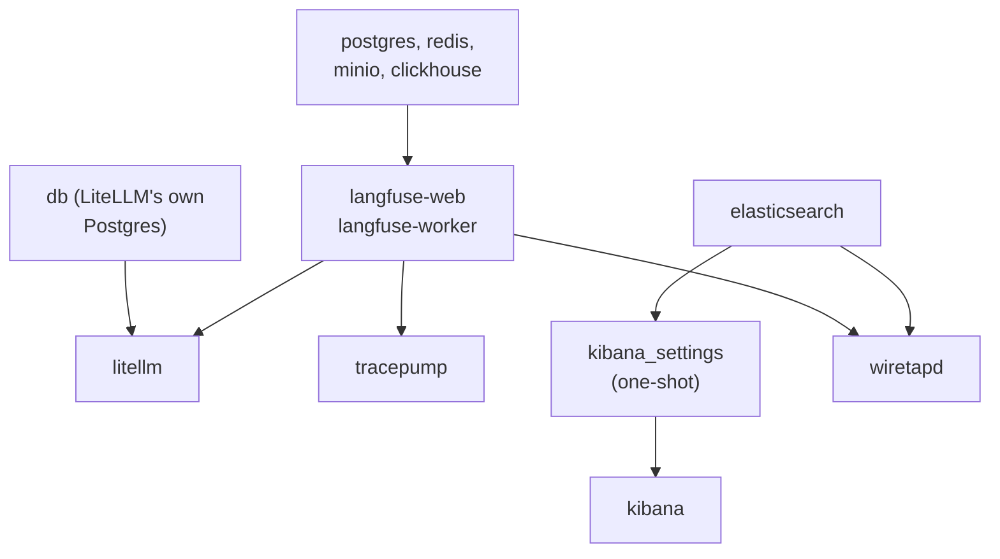

# RUNBOOK

This is the operational guide: how to start the stack, how to tell it's
actually working, and what to do when it isn't. If something's broken and
you're not sure where to start, start with the next section.

## If something's wrong, run this first

```bash
go run ./cmd/wiretapd check
```

This prints a pass/fail table for the four things most likely to be broken:
can it reach Langfuse (the service that records what the AI said), can it
reach Elasticsearch (the search engine everything ends up in), does the
Elasticsearch index template exist yet (see step 5 below), and is the
shared data file actually there and non-empty. Every troubleshooting
section below corresponds to one row of this table failing.

## 1. Configure `.env`

```bash
cp .env.example .env
```

Fill in every value in `.env` (see the group comments in `.env.example` for
what each one is for), including `KIBANA_ENCRYPTION_KEY`, generated with
`openssl rand -hex 32` (or similar).

## 2. Bring the stack up

```bash
docker compose up -d
```

This starts everything at once; Docker Compose figures out the order on
its own from each service's declared dependencies. Roughly:



## 3. Verify each service is healthy

```bash
docker compose ps
```

Expected `STATUS` column:

| Service | Expected status |
|---|---|
| `litellm` | `Up (healthy)` |
| `db` | `Up (healthy)` |
| `prometheus` | `Up` (no healthcheck defined) |
| `langfuse-web` | `Up` (no healthcheck defined) |
| `langfuse-worker` | `Up` (no healthcheck defined) |
| `clickhouse` | `Up (healthy)` |
| `minio` | `Up (healthy)` |
| `redis` | `Up (healthy)` |
| `postgres` | `Up (healthy)` |
| `elasticsearch` | `Up (healthy)` |
| `kibana_settings` | `Exited (0)` -- this is a one-shot bootstrap job, not a long-running service |
| `kibana` | `Up (healthy)` |
| `tracepump-init` | `Exited (0)` -- one-shot; fixes `tracepump_data` volume ownership before `tracepump` starts |
| `tracepump` | `Up` (no healthcheck; see below) |
| `wiretapd-init` | `Exited (0)` -- one-shot; same fix, for `wiretapd_state` |
| `wiretapd` | `Up` (no healthcheck; see below) |

For any service reporting `unhealthy`, get details with:

```bash
docker inspect --format='{{json .State.Health}}' <container-name> | python3 -m json.tool
```

`tracepump` and `wiretapd` have no Docker healthcheck -- they're background
pollers, not HTTP services with a port to probe. Confirm they're actually
working by tailing their logs:

```bash
docker compose logs -f tracepump
docker compose logs -f wiretapd
```

`tracepump` prints periodic `tracepump: poll ok, emitted N new trace(s)`
lines (every `TRACEPUMP_INTERVAL`, default 30s). `wiretapd` prints
structured JSON lines including `"msg":"index pass ok"` with counts of how
many records it read, parsed, and queued for Elasticsearch (every 10s by
default). Errors from either are logged, not silent.

## 4. Bootstrap the Elasticsearch index

Elasticsearch needs to be told, in advance, the shape of the data it's
about to receive (which fields exist, and what type each one is) -- this
is called a **mapping**, and getting it right matters (see `arch.md`'s
section on the `wildcard` field type for a concrete example of what goes
wrong if it's skipped). This one-time step creates that mapping:

```bash
go run ./cmd/wiretapd bootstrap
```

Safe to run more than once -- it's a plain overwrite of the same
definition, not an error, if the index already exists.

## 5. Generate some test data and confirm it flows through

```bash
go run ./cmd/wiretap
go run ./cmd/wiretapd check
```

`wiretapd check`'s fourth row should now show the archive as non-empty. Give
it another 30-60 seconds (one `tracepump` poll cycle plus one `wiretapd`
index cycle) and query Elasticsearch directly to confirm documents actually
arrived:

```bash
source .env
curl -s -u "elastic:$ELASTIC_PASSWORD" http://localhost:9200/wiretap-llm-events/_count
```

## Port reference

Every host port this compose file claims, all bound to `127.0.0.1` only:

| Port | Service | Purpose |
|---|---|---|
| 3000 | `langfuse-web` | Langfuse UI / API |
| 3030 | `langfuse-worker` | Langfuse background worker |
| 4000 | `litellm` | LiteLLM proxy (chat completions API) |
| 5432 | `postgres` | Langfuse's Postgres |
| 5433 | `db` | LiteLLM's own Postgres (remapped from 5432, which Langfuse's Postgres holds) |
| 5601 | `kibana` | Kibana UI |
| 6379 | `redis` | Langfuse's Redis |
| 8123 | `clickhouse` | ClickHouse HTTP interface |
| 9000 | `clickhouse` | ClickHouse native protocol |
| 9090 | `minio` | MinIO S3 API (remapped from 9000, which ClickHouse holds) |
| 9091 | `minio` | MinIO console |
| 9092 | `prometheus` | Prometheus UI (remapped from 9090, which MinIO holds) |
| 9200 | `elasticsearch` | Elasticsearch HTTP API |

`tracepump` and `wiretapd` publish no host port.

## Troubleshooting

### `wiretapd check` reports "langfuse reachable: FAIL"

Symptoms: a connection-refused or timeout error, or a 401.

- **Connection refused / timeout:** `langfuse-web` isn't up yet or isn't
  healthy. Check `docker compose ps langfuse-web` and its logs first.
- **401 Unauthorized:** `LANGFUSE_PUBLIC_KEY` / `LANGFUSE_SECRET_KEY` in
  `.env` don't belong to an actual Langfuse project. Create one via the
  Langfuse UI at http://localhost:3000 if you haven't, or via the
  `LANGFUSE_INIT_PROJECT_*` bootstrap variables. If you're relying on
  `LANGFUSE_INIT_PROJECT_PUBLIC_KEY`/`SECRET_KEY` to seed the project on
  first boot, remember those only take effect on Langfuse's *first ever*
  startup against an empty Postgres database -- changing them after the
  fact does nothing. Confirm directly:
  ```bash
  curl -u "$LANGFUSE_PUBLIC_KEY:$LANGFUSE_SECRET_KEY" http://localhost:3000/api/public/traces?limit=1
  ```

### `wiretapd check` reports "elasticsearch reachable: FAIL"

- **Connection refused:** `elasticsearch` isn't up yet or isn't healthy --
  check `docker compose ps elasticsearch` and its logs.
- **401 Unauthorized:** `ELASTIC_PASSWORD` in `.env` doesn't match what
  Elasticsearch actually has. See "Elasticsearch stuck `unhealthy`" below
  -- the same root cause (a password baked in at first boot) applies here
  even once the container reports healthy.
- **Running `wiretapd` from the host, not as a container:** double-check
  you haven't accidentally set `ELASTICSEARCH_URL` to the in-container
  hostname (`http://elasticsearch:9200`) -- that only resolves *inside*
  Docker's network. From the host, it's `http://localhost:9200`.

### Elasticsearch stuck `unhealthy` after running `docker compose up -d` with `ELASTIC_PASSWORD` blank

This happens if you brought the stack up before filling in `.env` (skipping
step 1 above). Elasticsearch only applies `ELASTIC_PASSWORD` when it first
bootstraps its security realm on that volume -- **filling in `.env` after the
fact does not retroactively change it**, because the `elastic` user's
password is already fixed in `elasticsearch_data`. Recreating the container
alone won't help either. Two ways out:

- **Reset in place (keeps any indexed data):**
  ```bash
  docker exec elasticsearch /usr/share/elasticsearch/bin/elasticsearch-reset-password -u elastic -a -f -b
  ```
  This prints a new password to stdout -- copy it into `.env` as
  `ELASTIC_PASSWORD` (it will not match whatever you originally wrote there),
  then `docker compose up -d` again so the healthcheck picks up the new value.
- **Start over (fine if the volume has nothing worth keeping yet):**
  ```bash
  docker compose down elasticsearch
  docker volume rm wiretap_elasticsearch_data
  docker compose up -d elasticsearch
  ```
  With `ELASTIC_PASSWORD` already correct in `.env` at this point, it bootstraps clean.

### `wiretapd` logs show bulk partial failures, or a growing `dead-letter.json`

Elasticsearch's bulk-index API is unusual: a request can come back with a
normal-looking success status even when some of the documents inside it
failed. `wiretapd` always checks each document's individual result, not
just the overall response -- so if you see this, it's real, not a
false alarm.

- **The failure was retryable** (Elasticsearch was briefly overloaded or
  rate-limiting): `wiretapd` retries these automatically with backoff --
  you'll see a `"retried"` count go up in its periodic counters log, and
  usually nothing further to do.
- **The failure was permanent** (a document's shape didn't match the
  index's mapping): it lands in `dead-letter.json` (inside the
  `wiretapd_state` volume) with the full Elasticsearch error attached, and
  is *not* retried in a loop. Inspect it:
  ```bash
  docker run --rm -v wiretap_wiretapd_state:/state alpine \
    cat /state/dead-letter.json
  ```
  Each line is one failed document plus the reason. A mapping error here
  usually means `internal/ecs`'s output shape and `internal/esink`'s index
  mapping have drifted apart -- check `internal/esink/bootstrap.go`'s
  `indexMapping()` against whatever field the error names.

### Kibana / a query returns zero results, but you expected data

Work through this in order:

1. **Is there actually anything to find?**
   ```bash
   source .env
   curl -s -u "elastic:$ELASTIC_PASSWORD" http://localhost:9200/wiretap-llm-events/_count
   ```
   If this is `0`, the problem is upstream of Elasticsearch entirely --
   check `wiretapd check`'s "archive readable and non-empty" row, and that
   `go run ./cmd/wiretap` has actually been run recently.
2. **Does the index exist at all?** If the count query itself 404s, you
   skipped step 4 (bootstrap) above.
3. **Is your query using the right field name and type?** A `wildcard`
   query against a `keyword` or `text` field (or vice versa) can silently
   return nothing instead of erroring -- see `arch.md`'s section on the
   `wildcard` decision, and confirm the field's actual mapped type:
   ```bash
   curl -s -u "elastic:$ELASTIC_PASSWORD" http://localhost:9200/wiretap-llm-events/_mapping | python3 -m json.tool
   ```

### Documents are present in Elasticsearch, but a field you expect is missing or empty

This is very likely correct, not a bug -- see `internal/parse`'s package
doc comment for the specific list of fields (`gen_ai.request.model`,
`MaxTokens`, `Temperature`, `FinishReasons`, `ResponseID`, among others)
that this project's actual Langfuse data has never reliably carried, and
which are deliberately left out of the document rather than filled with a
fabricated zero or empty string. `gen_ai.response.model` and
`gen_ai.usage.*` specifically are only present when Langfuse returned full
observation detail for that trace, not just an ID reference -- see
`internal/parse`'s `decodeObservations` doc comment. A missing field here
is the pipeline correctly saying "I don't know," which is a different
(and much safer) thing than silently guessing.

If a field you'd expect to *always* be present (like `trace.id` or
`llm.output`) is missing, that's a real bug -- check `wiretapd`'s logs
around the time that document was indexed for a `"skipping unparsable
archive line"` message, which would explain it.

## Resetting poisoned trace data

Before `cmd/wiretap` set an explicit `metadata.trace_id` per request,
LiteLLM's Langfuse callback fell back to deriving the trace ID from
`session_id`. Since `session_id` is intentionally shared across a whole
run (and across reruns), every scenario collapsed into one Langfuse trace:
input from one request paired with output from another, tags accumulated
from every outcome, and latency spanning days instead of one request. See
`notes.md` for the full failure mode and why `trace_id` must be unique
while `session_id` must not be.

That historical data is unusable and must be purged -- not silently patched
around -- so no ECS mapping or detection rule ever gets built against it.
**This is destructive and is not automated.** Run each step deliberately.

You can confirm which traces are affected first, without deleting anything,
using `cmd/tracescope`'s merged-trace warnings (added alongside the
`trace_id` fix): fetch a suspect trace ID and see if it prints a `WARNING:`
line for `id` equalling `sessionId`, or for carrying more than one of
`benign`/`injection`/`truncated` in its tags.

### 1. Stop the services that read or write the affected file

```bash
docker compose stop tracepump wiretapd
```

`tracepump` so nothing is mid-write when the file is removed; `wiretapd` so
it doesn't try to read a file that's about to disappear out from under it.

### 2. Delete the NDJSON archive and both its checkpoints

The archive and `tracepump`'s own checkpoint live in the `tracepump_data`
volume; `wiretapd`'s separate indexer checkpoint lives in `wiretapd_state`
(see `arch.md`'s "why a plain file sits in the middle" section for why
there are two checkpoints, not one). Neither `tracepump` nor `wiretapd` is
a shell-having image, so use a throwaway container against each volume
directly:

```bash
docker run --rm -v wiretap_tracepump_data:/data alpine \
  rm -f /data/langfuse-traces.ndjson /data/tracepump-state.json

docker run --rm -v wiretap_wiretapd_state:/state alpine \
  rm -f /state/wiretapd-index-state.json /state/wiretapd-fetch-state.json
```

Deleting the checkpoints (rather than editing them) is the required step,
not optional cleanup: both `tracepump` and `wiretapd` treat a missing
checkpoint as "nothing seen/shipped yet" and start over from the beginning.
If you delete the archive but leave either checkpoint in place, that
component will believe everything (poisoned data included) was already
handled, and will silently do nothing with the fresh file.

### 3. Bring both services back up

```bash
docker compose up -d tracepump wiretapd
```

`tracepump` does a full resync from Langfuse and repopulates the archive
from scratch; `wiretapd` then re-reads that archive from its own beginning
and re-indexes everything into Elasticsearch. Because `wiretapd` uses each
trace's own ID as the Elasticsearch document ID (see `arch.md`), this
re-indexing safely overwrites anything already there rather than
duplicating it.

### 4. The underlying Langfuse traces themselves

Deleting the archive and both checkpoints does not delete anything from
Langfuse -- the poisoned traces still exist in ClickHouse. You have two
options, and both are valid depending on what you're trying to preserve:

- **Delete them from the Langfuse UI** (http://localhost:3000). This is the
  only way to actually remove them from Langfuse itself.
- **Leave them in place.** Neither `tracepump` nor `wiretapd` can
  distinguish a poisoned trace from a good one -- they faithfully re-pull
  and re-index everything, poisoned traces included, on the full resync
  triggered by step 3. If you choose this, you must filter them out
  yourself (by trace ID, or by timestamp if you know the affected window)
  when building detection rules or Kibana data views, since nothing in
  this pipeline will do it for you.

## `docker compose down -v` warning

`-v` deletes every named volume, including data that is expensive or
impossible to regenerate. Before running it, know what you're giving up:

| Volume | Worth keeping? | Why |
|---|---|---|
| `langfuse_postgres_data` | **Yes** | Langfuse's projects, users, API keys, dashboards |
| `langfuse_clickhouse_data` | **Yes** | All Langfuse trace/observation history |
| `langfuse_minio_data` | **Yes** | Blob storage backing large trace payloads referenced by the above |
| `litellm_postgres_data` | **Yes** | LiteLLM's virtual keys, budgets, spend history |
| `tracepump_data` | Usually | The NDJSON archive and tracepump's checkpoint; losing it means tracepump re-emits Langfuse's full trace history on next boot -- harmless, just slower to catch up |
| `wiretapd_state` | Usually | wiretapd's own checkpoint(s) and dead-letter file; losing the checkpoint means it re-indexes everything on next boot (harmless -- see the `_id` idempotency note in `arch.md`), but you lose the dead-letter history |
| `langfuse_clickhouse_logs` | No | ClickHouse's own operational logs |
| `langfuse_redis_data` | No | Langfuse's queue/cache, fully disposable |
| `prometheus_data` | No | LiteLLM's Prometheus metrics history, regenerates from new traffic |
| `elasticsearch_data` | Depends | Whatever `wiretapd` has indexed -- keep if you've built detection rules or dashboards against it |
| `kibana_data` | Depends | Kibana's saved objects (data views, dashboards, detection rules) -- keep if you've done that work |

If in doubt, use `docker compose down` (no `-v`) instead -- it stops and
removes containers but leaves every volume intact.
