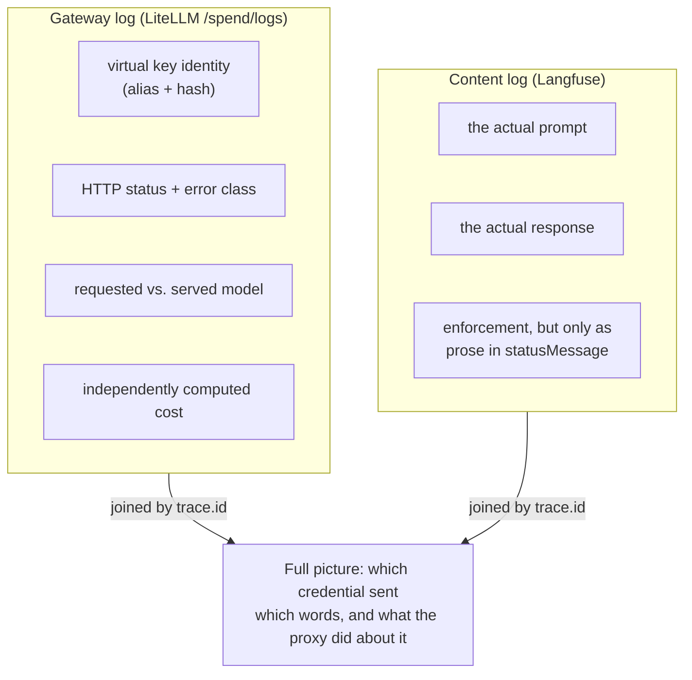
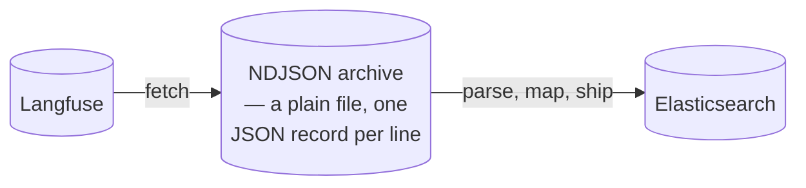
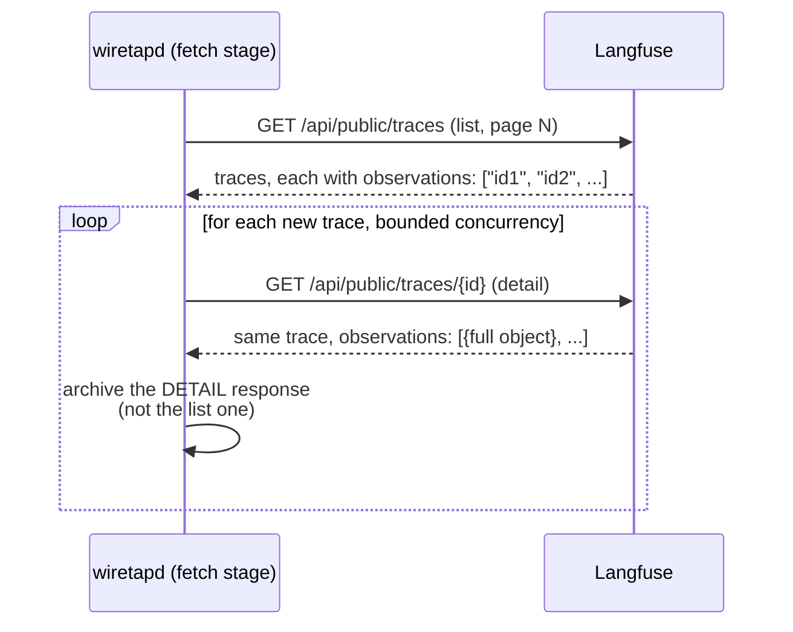
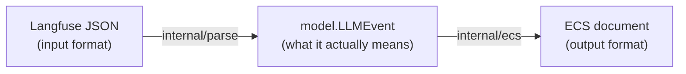
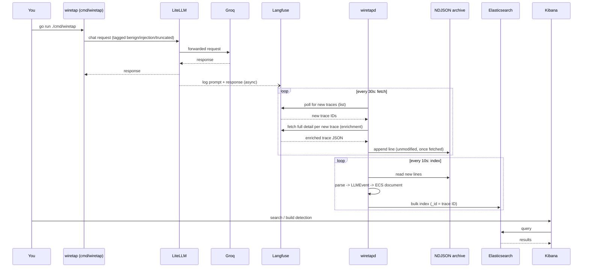

# Architecture

This explains how wiretap's pieces fit together, and *why* — not just what
each one does. Terms are explained the first time they show up, on the
assumption you might not have worked with proxies, message queues, or
search-engine schemas before.

## The two log sources: gateway vs. content

Two different systems each see half of every request, and neither half
tells the whole story alone.

- **The gateway log**, written by LiteLLM (the "proxy" every chat request
  passes through — "proxy" just means a server that sits in the middle and
  forwards requests on your behalf, the way a mail-forwarding service
  redirects letters to your new address). The gateway knows *who* called,
  *which model* they asked for, *when*, whether it *succeeded*, how many
  *tokens* it used (a token is roughly one word or word-fragment — it's how
  LLM providers measure and bill usage), and what it *cost*. It does not
  reliably know *what was actually said*: routing and accounting are its
  job, not transcription. In this deployment it doesn't know at all — the
  gateway's own records carry an empty `messages` and `response` field by
  default, so the separation is total rather than merely unreliable.
- **The content log**, written by Langfuse (a "tracing" tool wired into the
  same request path — tracing means recording a detailed timeline of one
  request: what went in, what came out, how long each step took). Langfuse
  knows the *actual prompt and response text*, but has a much thinner
  picture of authentication, quota enforcement, or billing.

### What the content log *can* see, corrected

An earlier version of this document claimed the content log is blind to
requests the gateway refuses — that a budget block or an auth failure
never reaches Langfuse at all. **That is wrong**, and it was wrong in a way
worth recording, because a plausible architectural story went unchecked
against the actual system for some time.

`config.yaml` sets `failure_callback: ["langfuse"]` as well as
`success_callback`. A refused request therefore *does* produce a Langfuse
trace, with its prompt intact, its observations marked `level: "ERROR"`,
and LiteLLM's enforcement text (`"Budget has been exceeded! Key=bob
(sk-...9SfA) ..."`) in `statusMessage`. Verified directly against live
traffic on 2026-07-31.

So the gateway plane is not what makes enforcement *visible*. What it adds
is that enforcement becomes **structured** rather than a sentence of
English, and that it attributes the request to a credential:

| Only the gateway plane has | Why it can't be recovered from the content plane |
|---|---|
| **HTTP status code** (`429`, `401`) | Langfuse records no status code anywhere on the trace. |
| **Error class** (`BudgetExceededError`, `KeyNotFoundError`) | Langfuse has only the human-readable message. Deriving a class from it means string-matching English prose — the exact "plausible but invented" move this project refuses. |
| **Enforcement reason as data** (budget ceiling, current spend, which limit tripped) | Present in the content plane only as substrings inside one message field. |
| **Virtual key identity** (alias + token hash) | Nowhere on a Langfuse trace's own fields. This is the identity of *which credential paid*, distinct from the end user who asked. |
| **Requested vs. served model, split** | Langfuse reports one `model` per observation whose meaning flips with the observation's level; the gateway reports `model`, `model_group`, and `custom_llm_provider` as separate fields. |
| **Independently computed cost** | The gateway computes cost from its own pricing table. Two independent numbers for the same request is what makes *disagreement* detectable — one number never can be. |

A detection like "flag any request where the model actually leaked our
canary secret" only needs the content log. A detection like "this user is
suddenly making 50x their normal request volume" only needs the gateway
log. A detection like "this *key* is hitting its budget ceiling while
sending injection-shaped prompts" needs both, joined by a shared ID —
because the prompt text lives on one side and the key identity on the
other, and neither side can see both.

wiretap currently only builds the content-log half of this (Langfuse →
Elasticsearch). The gateway-log half is a real, tracked gap — see
[docs/DETECTIONS.md](docs/DETECTIONS.md) for exactly which detections are
blocked on it.

One consequence of the correction above is already fixed in code: because
a blocked request *does* arrive from Langfuse, and arrives reporting
`usage: {input: 0, output: 0}` and a cost of `0`, this pipeline used to
index it as a request that ran, consumed nothing, and cost nothing —
indistinguishable from a free success. `internal/parse` now reads
observation level, leaves usage and cost genuinely **absent** when nothing
ran, and sets `event.outcome: "failure"` with the source's own message in
`error.message`. See `notes.md` for the worked example.

## Why a plain file sits in the middle of the pipeline

It would be simpler to fetch a record from Langfuse and immediately push it
into Elasticsearch, with nothing in between. wiretap deliberately doesn't do
that, for one reason: **the archive is a durable buffer, and the two halves
of the pipeline fail independently.**

If Elasticsearch is down, or a mapping bug ships and needs fixing, the
archive means you never have to go back and re-ask Langfuse for the same
data — you already have it on disk, and you replay it (`wiretapd backfill`)
straight through the fixed code. Without the archive, a mapping bug found a
week later would mean either accepting the bad data forever or replaying
history from Langfuse's own retention window, if it even still has it.
Fetching from Langfuse and shipping to Elasticsearch becoming two separate,
independently-retriable steps — rather than one step that has to succeed
atomically — is the entire reason this project has a `Fetcher` and an
`Indexer` (see `internal/pipeline`) instead of one combined stage, and the
entire reason they keep *two separate checkpoints* instead of one: an
Elasticsearch outage stalls the indexer's checkpoint, but the fetcher keeps
right on pulling from Langfuse regardless, because nothing ties them
together except the file.

## Two Langfuse endpoints, one archive: the enrichment tradeoff

Langfuse's public API has two different ways to ask about a trace, and
they return meaningfully different amounts of detail:

| Endpoint | What it returns |
|---|---|
| `GET /api/public/traces` (list, paginated) | Every trace on the page, but each one's `observations` field is just an array of ID strings — a pointer, not the data. |
| `GET /api/public/traces/{id}` (detail, one trace) | The same trace, but `observations` is now an array of full objects — and only those full objects carry token counts, the model that actually answered, and a few other fields this project needs. |

For a while, this project's fetch stage only ever called the list
endpoint. Every trace still got archived and indexed — but with
`observations` reduced to bare ID strings, none of the token-count or
model-name fields in `gen_ai.*` had anything to read, so they were always
absent. Every test still passed (correctly: absent is the honest
representation of "we never fetched that data," not a bug), and the
mapper's own code was never at fault — the gap was entirely in what got
fetched. See `notes.md` for this as a worked example.

The fix, called **enrichment** in this codebase, is straightforward in
concept and has one real cost: for every new trace the list endpoint
reports, the fetch stage now makes a *second* API call to the detail
endpoint to get the full observation objects, then archives that richer
response instead of the list-shaped one. That's **N+1 requests** for a
page of N new traces — a real, ongoing cost in API calls against Langfuse,
traded for fields that would otherwise always be empty. `internal/pipeline`
bounds this with a small worker pool (4 concurrent requests by default,
configurable) rather than firing all N at once, and treats a single
trace's enrichment failure as *that trace's* problem — skipped and
retried on the next poll — rather than letting one flaky request block
every other trace on the page. See `internal/pipeline/enrich.go`'s own
doc comments for the retry/backoff coordination details.

The archive still holds exactly one real API response per line, byte-for-
byte, faithful to what Langfuse actually sent — enrichment changes *which*
response gets archived (detail instead of list), never rewrites one after
the fact. That property is what makes `wiretapd backfill` safe here too:
replaying the archive re-parses real, complete API responses, not a
patched-up approximation of one.

## Why parsing and mapping are two separate steps (`internal/model`)

Langfuse's JSON shape is an *input* detail. ECS's field names are an
*output* detail. What actually matters — one LLM request, its prompt, its
response, its cost — is neither of those; it's the thing both of them are
trying to describe. `internal/model.LLMEvent` is that thing, written down
as a Go struct that doesn't know Langfuse's field names and doesn't know
ECS's field names either.

The payoff isn't abstract. This project's own `notes.md` documents a real
incident where trace data got silently corrupted (the "merged traces"
failure mode) — and the fix was possible to reason about clearly *because*
the parsing step and the meaning of the data were separated from how it
eventually gets displayed.

### How much this actually bought, once a second source arrived

This section used to predict that adding LiteLLM's gateway logs would mean
"a second file in `internal/parse`… `internal/ecs` doesn't change at all."
That prediction has now been tested, and it was **half right**. The
measured result:

| | Outcome |
|---|---|
| `internal/ecs` learning a LiteLLM field name | **Never happened.** It has never seen a Langfuse one either |
| ECS fields reused unchanged by the gateway mapper | **20** — trace ID, models, tokens, cost, status, timing, provenance |
| Content-plane golden files disturbed | **None** |
| New ECS fields the gateway forced | **7** — `event.type`, `event.action`, `error.type`, `error.code`, `http.response.status_code`, `llm.key.alias`, `llm.key.hash` |
| Structural changes forced | **1** — `event.dataset` was hardcoded to `"wiretap.langfuse"` in the mapper and had to become a parameter |

The reason the prediction missed is worth keeping: an intermediate
representation insulates the output format from the **input format's
churn**. It cannot insulate it from **vocabulary growth**. The gateway
knows things the content plane structurally cannot — which credential
paid, what status code came back, what class of refusal occurred — and
there is no amount of indirection that lets you write down a fact you have
no field for.

So the right claim is narrower than the original one, and still worth the
design: two parsers that share nothing produce one shape, one mapper's
common-field builder serves both, and the fields that describe the *same*
fact are defined once rather than twice. What it did not do is make the
mapper immune to change, and no IR could have.

## Regular index + alias, not a data stream — and the ID tradeoff that drove it

Elasticsearch (the search engine everything ends up in) offers a purpose-
built structure for exactly this kind of data — a continuous stream of
timestamped events — called a **data stream**. It handles a lot of
bookkeeping automatically (rolling over to a new backing index as data
grows, applying retention policies). wiretap doesn't use one.

The reason is one specific feature data streams give up: control over a
document's own ID. Elasticsearch calls the unique identifier for one record
its `_id`. wiretap sets `_id` to the trace ID — the same ID Langfuse itself
assigned — for every document it indexes. That one choice is what makes
`wiretapd backfill` (re-read the whole archive and re-index everything,
after fixing a mapping bug) *safe to run as many times as you want*:
indexing the same trace ID twice doesn't create a duplicate, it just
overwrites the same document with the same (or corrected) content. Data
streams either forbid setting your own `_id` or make it awkward, because
they're optimized for the assumption that every write is a new, distinct
event. wiretap's writes are frequently the *same* event, re-sent on
purpose, and that idempotency (a fancy word for "doing it twice has the
same effect as doing it once") was worth more here than the rollover
convenience a data stream would have given for free. That tradeoff is
recorded directly in `internal/esink`'s own code comments, next to the
decision it explains.

## Why `llm.output` and `llm.user_prompt` use the "wildcard" field type

Elasticsearch needs to know, in advance, how to store and search each field
— this is called a field's **mapping**, and getting it wrong for a field
doesn't usually error, it just makes searches against it quietly return
nothing. Three relevant mapping types:

- **`keyword`** — stored and matched as one exact, whole value. Fast, but
  can't efficiently search for a hidden substring in the middle of a long
  value.
- **`text`** — broken up into individual words (this is called
  *analysis*), so you can search "did this contain the word X anywhere,"
  but punctuation-adjacent substrings and exact phrasing get lost in the
  process. A hyphenated token like `XK9-Canaries-77` gets split into
  pieces, so a search for the *exact* string would silently fail.
- **`wildcard`** — built specifically for "does this contain this exact
  substring, anywhere," including a leading wildcard (`*something*`),
  without either of the above two problems.

This project's flagship detection — did the model leak a secret canary
token embedded in its own instructions? — is exactly that access pattern: a
short, exact substring that could appear anywhere inside a long response.
`llm.output` and `llm.user_prompt` are mapped `wildcard` for this reason and
this reason alone; every other text-shaped field in this schema uses
`keyword` or plain `text` because nothing else needs a mid-string,
leading-wildcard search. Get this mapping wrong and the detection doesn't
crash — it just silently never fires. See `internal/esink`'s mapping code
for the field-by-field reasoning, and
[docs/DETECTIONS.md](docs/DETECTIONS.md) for the actual query this mapping
exists to support.

## End-to-end sequence

`wiretapd` is the only ingestion service in the default deployment: it
fetches from Langfuse (enriching each new trace as it goes, see above),
archives, maps, and indexes, all in one process with two independently-
paced loops sharing nothing but the archive file (see "why a plain file
sits in the middle," above, for why that's deliberate). An earlier
revision of this stack split fetching into a second, separate service
(`tracepump`) — removed once it became clear that combination could leave
enrichment silently never running at all (see `notes.md`'s worked
example) and risked a real timing race between two independent fetchers
writing the same archive. `cmd/tracepump` still exists as a standalone
tool for anyone who specifically wants a plain, unenriched, faithful pipe
with nothing else attached; it's just not part of the default compose
services anymore.

