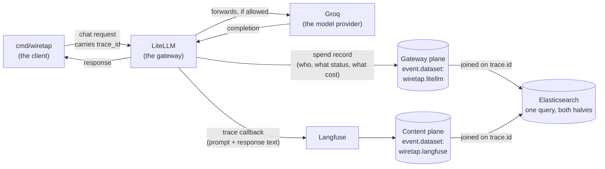
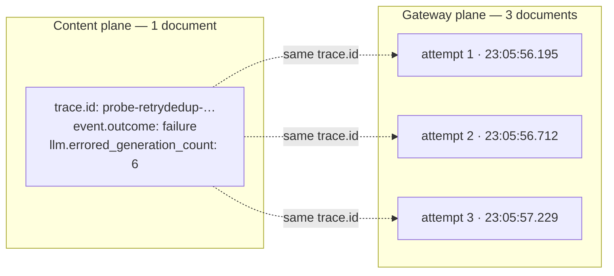

# Correlation: joining the gateway plane and the content plane

This document is the design for wiretap's second log source and the join
that gives it its point. It is written to be read before the code exists,
and it defines terms on first use on the assumption you may not have
worked with log correlation, index mappings, or query languages before.

**The one-sentence version:** two systems each record half of every LLM
request, wiretap indexes both into Elasticsearch, and a shared identifier
called `trace.id` lets a single query see both halves at once — but only
if that identifier really survives into both, which is the thing this
design spends most of its effort making impossible to get silently wrong.

---

## 1. The two planes

A **plane** here just means "one system's view of the same events." Two
systems sit in the path of every chat request this project makes, and each
writes down a different half of what happened.



### What each plane knows

| | Gateway plane (LiteLLM) | Content plane (Langfuse) |
|---|---|---|
| Prompt and response text | **Never.** `messages` and `response` are empty by default | Yes — this is its whole reason to exist |
| Virtual key identity (alias, hash) | **Yes** | No |
| HTTP status code | **Yes** (`429`, `401`, …) | No |
| Error class as a value | **Yes** (`BudgetExceededError`) | No — only English prose |
| Enforcement message | Yes, structured | Yes, as prose in `statusMessage` |
| Requested vs. served model | **Yes, as separate fields** | One field whose meaning flips with severity |
| Cost | Yes, from its own pricing table | Yes, from Langfuse's own pricing table |
| Token counts | Yes | Yes |
| Source IP | Only on **successful** requests | No |
| One row per… | **HTTP attempt** (a retried request makes three) | logical request (one trace) |

### What neither plane knows

Worth stating plainly, so nobody goes looking:

- **Whether a prompt was actually malicious.** Both planes record what
  happened; neither grades it. That judgement is a detection's job, and
  wiretap's own ground-truth labels stay quarantined under `labels.*`
  precisely so they can never be mistaken for evidence.
- **The client's retry count.** `X-Stainless-Retry-Count` is sent by the
  client on every retry and stored by neither plane.
- **Why a key exists or who owns it.** Key *identity* is on the gateway;
  key *ownership* lives in LiteLLM's management tables, which wiretap does
  not ingest.

### What is only knowable by joining

This is the payoff, and it is a short list on purpose. Each of these needs
a field from each side, so no single-plane query can express it:

| Question | Needs from content plane | Needs from gateway plane |
|---|---|---|
| Which **credential** sent an injection-shaped prompt? | `llm.user_prompt` | `llm.key.alias` |
| Is the same prompt being sent from **multiple keys**? | `llm.user_prompt` | `llm.key.alias` |
| Did an attack attempt get **blocked**, or did it go through? | injection phrasing | `event.outcome`, `error.type` |
| Do the two planes **disagree** about cost or model? | its cost / served model | its cost / served model |
| Did a completion happen that the gateway **never saw**? | the trace exists | the absence of a row |

That last row is not an attack detection. It is how you find out the
pipeline is lying to you, and section 3 is mostly about it.

---

## 2. The join key

### Which field, and why

**Primary: `trace.id`, carried to the gateway plane via
`metadata.spend_logs_metadata.trace_id`.**

The client already generates a unique `trace_id` per request and sends it
as `metadata.trace_id`, which LiteLLM's Langfuse callback uses as the
Langfuse trace ID and which wiretap indexes as `trace.id`. That value does
**not** reach the gateway's spend record — LiteLLM does not forward
arbitrary caller metadata into its spend log.

LiteLLM does forward one specific field: anything under
`metadata.spend_logs_metadata` is preserved verbatim on the spend record.
Verified on live traffic (2026-07-31) for all three outcomes:

```
success   chatcmpl-ec75bd8c-…   spend_logs_metadata = {"trace_id": "probe-success-e7915e6d00661154"}
blocked   63568d8c-ac3a-…       spend_logs_metadata = {"trace_id": "probe-blocked-524a9bd6fb08113e"}
authfail  acb4a8a7-a105-…       spend_logs_metadata = {"trace_id": "probe-authfail-b469cbc39f389eea"}
```

So the client must send the same value twice, under two different keys.
That redundancy is not elegant, and it is the price of an exact join that
covers refused requests.

**Fallback: the completion ID.** On a successful request the gateway's
`request_id` *is* the provider's completion ID (`chatcmpl-…`), which
wiretap already extracts into `gen_ai.response.id`. This works today with
no client change — and only for successes. On a refused request there is
no completion, and `request_id` is an unrelated LiteLLM UUID.

Measured coverage over a real 15-document run:

```
matched via spend_logs_metadata.trace_id:  9/9 requests that sent it   (successes AND failures)
matched via completion id:                 8/8 successes, 0/7 failures
```

The fallback covers exactly the requests the gateway plane is least needed
for. It is worth keeping as a cross-check — a request that matches on one
key but not the other is itself a signal — but it cannot be primary.

### Rejected: `session_id`

LiteLLM **discards the caller's `session_id` on a refused request and
substitutes a random UUID.** A request sent with `session_id:
"probe-session"` produced a gateway row reading
`b3defaac-bb27-4909-bf76-86d9c6b98c7c`. Any join built on it would appear
to work on successes and silently fail on exactly the enforcement events
the gateway plane exists to capture — the worst possible failure shape.

### Cardinality: the join is one-to-many, and the "many" is retries



One logical request that the client retried three times produces **one**
content document and **three** gateway documents. Verified: three rows,
distinct `request_id`s, identical `spend_logs_metadata.trace_id`.

**Every rule that counts enforcement events must count distinct
`trace.id`, not documents.** A `count()` over gateway documents reports
three budget blocks where a user experienced one. In an incident, "this key
was blocked 30 times in an hour" versus "10 times" is the difference
between a plausible misconfiguration and an apparent attack.

The ratio is itself useful: `count(docs) / cardinality(trace.id)` over a
window is the average attempts-per-request, and a jump in it means a retry
storm.

### Failure modes of the join

| Failure | What it looks like | How it is caught |
|---|---|---|
| Client stops sending `spend_logs_metadata` | Gateway rows have no `trace.id`; all correlation returns zero hits | Gateway-side unmatched rate → 100% |
| Someone bypasses the gateway | Content event with no gateway row | Content-side unmatched rate rises |
| Gateway fetcher stalls | Content-side unmatched rate rises steadily | Same metric, plus per-source fetch counters |
| Langfuse callback dropped | Gateway row with no content event | Gateway-side unmatched rate rises |
| Ingestion lag mistaken for breakage | Both rates spike near "now" | The measurement window is **lagged** — see below |
| `trace.id` collides between requests | Two content events match one gateway row | 128 bits of `crypto/rand` per ID; treated as not a real risk |

### The unmatched-rate metric

> This repository has already lost roughly forty-nine hours to a broken
> join key that produced plausible, fully-populated, entirely false
> documents. A silent join failure looks *exactly* like an absence of
> attacks. The design therefore does not assume the join works; it
> measures it continuously and says so out loud.

Two numbers, computed over the same window, reported in structured logs
and queryable in Elasticsearch:

```
content_unmatched_rate = content events in window with no gateway event sharing trace.id
                         ────────────────────────────────────────────────────────────────
                                        content events in window

gateway_unmatched_rate = distinct trace.ids in gateway window with no content event
                         ────────────────────────────────────────────────────────────
                                   distinct trace.ids in gateway window
```

Both directions are required. A one-directional check passes happily while
one source is completely dead.

**The window must be lagged, not trailing-to-now.** The two planes have
different ingestion latencies — the gateway's spend rows are written in
batches every 10–15 seconds, Langfuse's traces land in 1–5 seconds. A
window ending at "now" therefore always shows recent content events with
no gateway partner yet, and would report a healthy pipeline as broken. The
window ends at `now - 120s`, comfortably clear of both.

**Expected baseline is zero, and that matters.** Anything that is
*legitimately* unmatched must be excluded from the denominator rather than
tolerated as noise, because a metric with a fuzzy normal range cannot be
alerted on. Known exclusions: LiteLLM's own health checks, dropped on
**both** planes by `--skip-healthchecks` (on by default) at fetch and at
index.

A health check produces a Langfuse trace *and* a LiteLLM spend row, and
the spend row carries no `spend_logs_metadata` — so it can never hold a
join key. Filtering one plane but not the other therefore does not merely
leave noise: it puts a permanent nonzero floor under
`gateway_docs_without_join_key` and skews any per-key baseline computed
off the gateway index. LiteLLM marks both sides with the same literal,
`litellm-internal-health-check` — as a request tag (which reaches Langfuse
as a trace tag and the spend row as `request_tags`) and as the identity of
the synthetic service account it bills (`api_key`, `team_id`,
`metadata.user_api_key{,_alias}`, `metadata.user_api_key_team_id`). Both
are checked; `call_type` is not one of them, since a health check is an
ordinary `acompletion`. See `parse.isGatewayHealthCheck`.

A non-zero rate is an incident, not a curiosity, and the runbook says so.

---

## 3. Index strategy

**Recommendation: two indices, one shared pattern, distinguished by
`event.dataset`.**

| | Index pattern | `event.dataset` |
|---|---|---|
| Content plane | `wiretap-llm-events-*` (unchanged) | `wiretap.langfuse` |
| Gateway plane | `wiretap-llm-gateway-*` (new) | `wiretap.litellm` |
| Shared pattern | `wiretap-llm-*` | — |

One Kibana **data view** (Kibana's name for a saved index pattern you point
queries at) over `wiretap-llm-*` sees both. That is what lets an EQL
sequence query — one that looks for event A followed by event B — span the
two planes at all, since a sequence cannot cross two data views.

Keeping the content plane's existing name avoids migrating live data for a
cosmetic gain. Symmetrical names (`…-content-*` / `…-gateway-*`) would read
better; they are not worth a reindex of every historical document.

### Why not one index with both shapes?

Genuinely tempting — a single index needs no shared pattern and no join
across indices at all. Rejected for three reasons:

1. **Field-meaning collisions.** `llm.output` is a `wildcard` field the
   canary detection greps. The gateway plane has no output, ever. In a
   shared index that field is present-but-always-empty on half the
   documents, and `NOT llm.output: *` silently becomes "or it's a gateway
   document."
2. **Mapping conflicts are permanent.** If either plane ever indexes a
   field with a type the other disagrees on, Elasticsearch rejects the
   write, and the fix is a full reindex. Separate indices contain the
   blast radius to one dataset.
3. **Independent lifecycle.** The gateway plane is higher-volume (one row
   per HTTP *attempt*) and cheaper per document. Separate indices allow
   separate retention without a custom delete-by-query.

### The mapping-conflict risk exists either way

Separate indices do **not** eliminate it — they relocate it. A field
queried across the shared `wiretap-llm-*` pattern must have the *same type*
in both indices, or the cross-plane query fails or silently misbehaves.
The fields this applies to are exactly the shared vocabulary:
`@timestamp`, `trace.id`, `event.*`, `error.*`, `gen_ai.*`, `user.id`.

Mitigation: both index templates declare those fields explicitly, with no
dynamic mapping on either side, and a test asserts the shared fields have
identical mappings in both templates. Getting this wrong does not throw an
error; it returns wrong results, which is why it gets a test rather than a
comment.

---

## 4. Field ownership

"Authoritative" means: when the two planes disagree, this is the one a
detection should trust. It does **not** mean the other plane's value is
discarded — keeping both is what makes disagreement detectable at all.

| ECS field | Authoritative | Why |
|---|---|---|
| `trace.id` | Both (identical by construction) | It is the join key; disagreement is impossible by definition |
| `@timestamp`, `event.start`, `event.end` | Gateway | Records the request itself, not when a callback fired — see §5 |
| `event.outcome` | **Gateway** | Derived from an HTTP status code, not inferred from severity |
| `error.type`, `error.code` | **Gateway only** | Content plane has no structured error class |
| `error.message` | Both | Same underlying text; content plane's is often the only copy for non-enforcement errors |
| `http.response.status_code` | **Gateway only** | Content plane has no concept of one |
| `llm.key.alias`, `llm.key.hash` | **Gateway only** | The identity of *which credential paid* |
| `user.id` | Content | The end user who asked, from caller metadata |
| `gen_ai.request.model` | Gateway | Reports `model_group` as a distinct field |
| `gen_ai.response.model` | Gateway | Reports the served model separately from the requested one |
| `gen_ai.system` | **Gateway** | Reports `custom_llm_provider` directly; the content plane requires deriving it from a model-name prefix |
| `llm.user_prompt`, `llm.output`, `llm.messages` | **Content only** | The gateway never sees content |
| `gen_ai.usage.*` | **Gateway** | See below |
| `llm.total_cost_usd` | **Gateway** | See below |

### Usage and cost: gateway wins, and disagreement is a detection

Both planes report token counts and cost. The gateway is authoritative for
three reasons:

1. **It is the system of record for billing.** Its number is what
   decrements the budget and triggers the 429. A spend detection that
   disagrees with what enforcement actually acted on is worse than none.
2. **Independent computation.** The content plane's cost comes from
   Langfuse's own model-pricing table, a separate configuration that can
   drift.
3. **Availability.** The gateway reports cost for every successful request;
   the content plane's is absent when Langfuse lacks pricing for a model.

Observed agreement on real matched pairs is essentially exact — gateway
`2.341e-05` versus content `2.3409999e-05`, a relative difference of about
`4e-8`, which is float representation noise and nothing else.

**A tolerance of 1e-6 relative difference** therefore sits roughly two
orders of magnitude above the observed noise floor and far below any real
drift. Exceeding it means something has genuinely changed: a pricing table
updated on one side only, a model silently rerouted, or — the reason this
is a detection and not a data-quality warning — usage figures being
manipulated. **Disagreement is a signal to raise, not a discrepancy to
smooth over**, and neither plane's value is overwritten by the other's.

---

## 5. Time semantics

The two planes timestamp *different instants*, and the gap between them
varies with how long the request took. Measured on real matched pairs:

```
trace                        gateway startTime   Langfuse trace ts   Langfuse obs start   obs end
probe-success-e7915e6d…      23:02:34.989        23:02:35.276        23:02:34.989         23:02:35.273
probe-fill2-3d314ff24337     23:02:46.261        23:02:46.363        23:02:46.261         23:02:46.360
probe-fill4-fbbb6d24252a     23:02:48.511        23:02:48.612        23:02:48.511         23:02:48.604
probe-blocked-524a9bd6fb…    23:03:02.653        23:03:02.646        23:03:02.644         23:03:02.648
```

Three findings, and the third is the useful one:

1. **Langfuse's *trace* timestamp is when LiteLLM's callback fired**, not
   when the request started. For a success that is after the response
   arrives (+287ms, +102ms, +101ms — each ≈ the request duration). For a
   refused request, which resolves instantly, it lands near the start. It
   is therefore neither reliably "start" nor reliably "end", and building
   a correlation window on it would mean tolerating a gap that grows with
   model latency.

2. **This is what `@timestamp` currently carries on `wiretap.langfuse`.**
   Not wrong, but not what it looks like.

3. **Langfuse's *observation* `startTime` matches the gateway's
   `startTime` to the millisecond** — `23:02:34.989` on both,
   `23:02:46.261` on both. Both planes are recording the same instant from
   the same process; there is no meaningful clock skew because there are
   no two clocks.

### The resulting definitions

Both datasets populate `event.start` and `event.end` explicitly rather
than leaving `@timestamp` to carry an unstated meaning:

| Field | `wiretap.litellm` (gateway) | `wiretap.langfuse` (content) |
|---|---|---|
| `event.start` | `startTime` — request start | **earliest observation `startTime`** — request start |
| `event.end` | `endTime` — request end | **latest observation `endTime`** — request end |
| `@timestamp` | = `event.start` | Langfuse trace timestamp = **when the callback fired** (unchanged, for compatibility) |
| `event.duration` | `request_duration_ms` → ns | trace `latency` → ns |

**Correlate on `event.start`, never on `@timestamp`.** Comparing
`event.start` across planes compares the same instant recorded twice.
Comparing `@timestamp` compares a request's start against a callback's
firing, and the error is exactly one request duration — unbounded above,
since it grows with however long the model takes.

### How much skew a correlation window must tolerate

Because `event.start` agrees to the millisecond, the window is not
absorbing clock error. It only needs to cover the genuine spread of
*related* events:

| Source of spread | Observed |
|---|---|
| Same request, both planes, `event.start` | < 2 ms |
| Retry fan-out (first to last attempt) | ~1.04 s for 3 attempts |
| Client retry backoff, worst case | seconds |

**A ±5 minute correlation window** is recommended: three orders of
magnitude above the observed spread, comfortably absorbing pathological
retry backoff, and still narrow enough that unrelated requests from the
same key do not collapse together at this project's request rate. A window
under ~2 seconds would drop slow requests and split retry groups.

Note this is the window for *correlating* events. The *join-health
measurement* window is a different thing with a different constraint — it
must be lagged by 120s to clear ingestion latency, per §2.

---

## 6. What this design commits to

- `trace.id` is the join key, carried by
  `metadata.spend_logs_metadata.trace_id`, with the completion ID as a
  successes-only cross-check.
- Enforcement counts are over **distinct `trace.id`**, never document
  count.
- Two indices, `event.dataset` distinguishes them, shared fields have
  identical mappings in both templates, enforced by a test.
- The gateway is authoritative for cost, usage, outcome, and provider;
  **disagreement between planes is a detection, not a bug to hide**.
- `event.start` is the correlation timestamp on both planes; `@timestamp`
  means something different per dataset and is documented as such.
- The unmatched rate is measured in **both directions**, over a **lagged**
  window, with a baseline of zero — because a broken join and a quiet
  network are indistinguishable without it.
