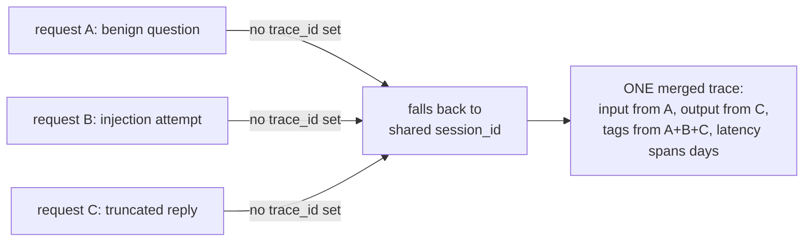
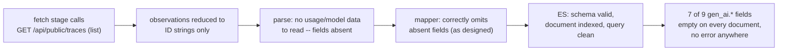

### Field Definitions & Detection Logic

* **`trace_id`**: Acts as a pivot or join key. It goes in YARA-L outcome variables, not the condition. It is emitted as evidence for investigations to reconstruct attack chains.


* **`user_id`**: Acts as the aggregation spine. It is mandatory for all behavioral detections, such as refusal rate, token rate, and payload diversity.


* **`session_id`**: Represents the multi-turn attack window, typically the conversation ID in production. It is required to detect escalation and crescendo-style jailbreaks that span multiple turns and bypass single-turn detection.


* **`name`**: Acts as a scoping dimension that identifies the specific feature or endpoint hit. It is used to determine event severity.


* **`model`**: Identifies routing anomalies, such as sensitive traffic unexpectedly served by a fallback model. It enables model-aware thresholds for tuning rules, as refusal phrasing and rates differ per model.


* **`tags`**: Operational tags (like environment or version) provide legitimate scoping context. Outcome labels (like injection or benign) provide ground truth for evaluation only and must never be used as detection inputs.


* **`latency`** & **`completion_tokens`**: Serve as weak per-event features. Short completions indicate refusals but also cause false positives on greetings or terse answers, requiring combination with other signals.


* **`input_content_user_role`**: Serves as the classifier's input and represents evidence of an attempt. Detections must key on derived features like structural anomalies, base64 blobs, or classifier scores, rather than raw text.


* **`output_content_assistant_role`**: Serves as evidence of effect to distinguish an attempt from a success. A canary in the output confirms exfiltration with near-zero false positives, while a refusal in the output confirms a blocked attempt.


### Failure Mode: Merged Traces (why `trace_id` and `session_id` are not interchangeable)

Observed in production data, not hypothetical: three semantically distinct
requests -- a benign question, a prompt injection, and a truncated
completion -- collapsed into a single Langfuse trace, accumulating for days
before it was noticed. The proximate cause: the client never set an
explicit `trace_id`, so LiteLLM's Langfuse callback derived one from
`session_id` instead. Since `session_id` is deliberately shared across a run
(and reused across reruns, by design), every request sharing that session
wrote into the same trace.

What broke, concretely:

* **`input`/`output` pairing became fabricated.** The stored `input` was
  the injection prompt; the stored `output` was the benign scenario's VPN
  answer. Any detection correlating prompt against completion was reading a
  pair that never actually happened together.
* **`tags` became the union of every outcome.** `benign`, `injection`, and
  `truncated` all landed on the same trace. Tag-based filtering selected
  everything, which is indistinguishable from selecting nothing.
* **`latency` stopped meaning request duration.** It measured the span
  between the first and last observation across days of runs (~49h in the
  observed case), not the time to serve one completion.
* **`observations` held entries from unrelated requests**, so anything
  iterating a trace's observations to reconstruct one interaction was
  actually reconstructing several, interleaved.

Why this matters more than it looks like it should: the merged trace is
still valid JSON, still has an `id`, a `sessionId`, `tags`, `input`, and
`output` -- every field a detection rule or a dashboard expects is present
and non-null. It is queryable. It looks like data. A rule built against it
runs, produces results, and is wrong in a way that isn't visible from the
output alone -- there is no error, no gap, no null field flagging the
problem. Missing data is at least legible as missing; this was worse,
because it required already knowing what a correct trace looks like to
notice anything was off. That is the general shape of the risk: telemetry
that is syntactically valid but semantically false is more dangerous than
telemetry that is absent, because absence gets noticed and silently-wrong
data does not.

The fix generalizes: **`trace_id` must be unique per request; `session_id`
must be shared across the requests that belong together.** They encode
different, non-substitutable groupings -- one request vs. one multi-turn
conversation -- and an ID scheme that lets one silently stand in for the
other will merge unrelated requests with no signal that it happened. Any
future field meant to identify "one distinct thing" should be checked for
this same failure mode: does something else in the pipeline quietly fall
back to a shared field when this one is left unset?



### ECS mapping decisions: where the standard schema runs out

ECS (the Elastic Common Schema -- a shared vocabulary of field names, so
that different tools and different teams' data can be searched the same
way) has a `gen_ai.*` field group purpose-built for LLM telemetry:
`gen_ai.request.model`, `gen_ai.usage.input_tokens`, and so on. Every field
this project writes under `gen_ai.*` is checked, by hand, against Elastic's
own reference doc (`docs/reference/ecs-gen_ai.md`) before it's used --
see `internal/ecs/genai.go` for the field-by-field citations.

That reference doc has no field for the actual prompt or completion text.
This isn't an oversight -- OpenTelemetry (the standard ECS's Gen AI fields
are based on) deliberately keeps message content out of its span
attributes, because content is frequently sensitive and frequently large,
and a tracing standard meant for every possible LLM integration can't
assume it's always safe to store verbatim.

This project's own detections need that content -- the canary-token check
greps the response text; the prompt-injection check greps the request text.
So it lives under `llm.*` instead: a namespace this project invented,
clearly documented as *not* ECS everywhere it appears (see `internal/ecs`'s
package doc and `llm.go`), specifically so nobody mistakes it for a
standard field or assumes it means the same thing in a different system. If
ECS ever adds a real content field, `llm.*` is the thing to revisit.

The rule this project holds itself to: **a plausible-looking wrong field
name is worse than a missing one.** A field that doesn't exist fails loudly
-- the query returns nothing, and that's investigable. A field that exists
under the wrong name, or with the wrong type, *looks* like it's working and
silently answers a different question than the one being asked. Every
`gen_ai.*` field in this project was checked against the reference doc for
exactly this reason, not as a formality.

### Failure Mode: The Empty `gen_ai.*` Fields (a schema that validated, tested green, and emitted nothing)

Observed in this project's own history, not hypothetical: seven of the nine
`gen_ai.*` fields this project maps -- both token counts, the requested and
answering model names, the max-tokens setting, the response ID, and finish
reasons -- were permanently empty on every real document, from the first
commit that introduced `gen_ai.*` mapping up until this was diagnosed and
fixed. Not empty on some documents. Empty on all of them, silently, the
entire time.

The proximate cause: Langfuse's public API has two endpoints for reading a
trace back (see `arch.md`'s "Two Langfuse endpoints, one archive" section
for the full shape difference), and only one of them -- the list endpoint,
`GET /api/public/traces` -- was ever called by the fetch stage. The list
endpoint reduces each observation to a bare ID string. The detail endpoint,
`GET /api/public/traces/{id}`, returns the same observation as a full
object with `usage`, `model`, `metadata`, and `modelParameters` attached --
and every one of those seven fields reads from data that only exists on
that full object. A `GetTrace` function that called the detail endpoint
already existed in `internal/langfuse`, fully typed and unit-tested; it was
just never wired into the fetch stage that actually runs in production.
`internal/pipeline` only ever called `ListTraces`.

What makes this failure mode distinct from the merged-traces one above:
that one was silently *wrong* (a plausible-looking value that was actually
fabricated from unrelated data). This one was silently *absent* -- which
this project's own stated doctrine treats as the honest, lower-risk
outcome ("absence is at least legible as missing"). And in one sense that
doctrine held: nobody was misled by a fake token count, because there was
never a fake token count, only a missing one. But absence being *honest*
does not mean absence being *invisible* is acceptable, and here it was
invisible for a specific, structural reason:

* **The mapper was correct.** `internal/ecs/genai.go` read the right struct
  fields, under the right names, with the right types, cited against
  `docs/reference/ecs-gen_ai.md`. There was no bug to find by reading that
  file.
* **The tests were green.** `TestMap_NoGenAIFieldEmittedAsZeroSubstituteForMissing`
  specifically asserts that an absent field stays absent rather than being
  coerced to a zero value -- and it passed, correctly, on every run,
  because the fields genuinely were absent given the input the mapper was
  handed. The test was validating the right property; it just had no way
  to know the *input itself* was thinner than production data actually is.
* **The schema validated.** Every document indexed cleanly, matched its
  mapping, and was queryable. A dashboard built against `gen_ai.usage.*`
  would show real, legitimate-looking empty results -- not an error, not a
  missing index, just consistently nothing -- and "consistently nothing"
  is far more easily misread as "this traffic pattern has no token usage"
  than as "this pipeline never fetched the field."

The gap was never inside the boundary anyone was actually checking. It was
one layer upstream, in *what got fetched*, not in what got parsed or
mapped from what was fetched. This is why Task 1 of the fix that resolved
this was investigation-only, with an explicit instruction not to touch the
mapper to compensate: changing `internal/ecs/genai.go` to paper over a
fetch-layer gap would have made the mapper *wrong* to make the pipeline
*look* right, which is a strictly worse trade than the honest absence that
came before it.



The fix generalizes past this one incident: **a green test suite proves the
code does what the test describes, not that the test describes what
production actually needs.** `TestMap_NoGenAIFieldEmittedAsZeroSubstituteForMissing`
was never wrong -- it just wasn't sufficient on its own, because nothing in
this project's test suite exercised the fetch stage against the *shape*
of data the detail endpoint actually returns until real captured fixtures
(`internal/langfuse/testdata/detail_truncated.json`,
`detail_benign.json`) were added specifically to close that gap. When a
field is unexpectedly, permanently absent across every record, the
question to ask before assuming "this data genuinely doesn't exist" is
"did every step between the source system and this field actually run,"
starting from the network call outward -- not just from the mapper
inward, which is the direction a bug usually gets looked for first.

### The canary-in-the-system-prompt trap (why detections must be scoped to output, not input)

Every scenario this project sends carries the same canary string
(`XK9-Canaries-77`) embedded in its *system prompt* -- the fixed
instructions the model is given before the user's message, invisible to
the user, present on literally every single request regardless of whether
that request is an attack. This is deliberate: the system prompt is where a
real deployment would put an actual secret it doesn't want leaked.

The trap: if a detection rule is scoped to check for the canary anywhere in
the *request* -- input, system prompt, the whole document -- it will match
every single trace this project ever produces, attack or not, because the
canary is *always* present on the input side. A detection that fires on
100% of traffic is not a detection; it's noise with extra steps, and it
will get disabled by whoever has to live with the alert volume.

The canary only means something when it shows up somewhere it shouldn't:
in the model's *output*. A model correctly following its instructions never
repeats the canary back; a model that's been successfully manipulated into
ignoring its system prompt might. That's why this project's canary
detection (see docs/DETECTIONS.md) is scoped to `llm.output` only, and why
`internal/ecs` has a test (`TestMap_CanaryOnlyInSystemPromptNeverInOutput`)
that fails loudly if the canary ever shows up in a mapped document's output
field across any of the three test scenarios -- a regression here would
mean either the detection query or the mapping itself is scoped wrong, and
either one silently turns a precise detection into permanent background
noise.


### Array order is not chronological order (and the bug that hid behind one generation)

`internal/parse`'s `applyGenerations` has always documented a rule for
traces with more than one generation: token counts get *summed*, while
single-valued fields (the answering model, the completion ID,
`max_tokens`) take the **last** generation, because in a retried or
multi-turn exchange the final call is the one that produced the output.

That comment was right about intent and wrong about mechanism. The code
iterated Langfuse's `observations` array front to back and let later
iterations overwrite earlier ones — so "last" meant *last array element*,
and the comment's "last" meant *latest in time*. Those are only the same
thing if the array happens to be sorted, and **Langfuse does not sort it**.
Nothing in Langfuse's API documentation says it does, and nothing in this
project ever checked.

It stayed invisible for a simple reason: **every real trace this project
had ever captured contained exactly one generation.** With one element,
array position and chronology cannot disagree. The assumption was load-
bearing, undocumented, untested, and unfalsifiable by the data on hand.

What exposed it was not reading the code more carefully. It was
*deliberately constructing the case that could disagree* — sending one
request that got refused and a second, later request reusing the same
`trace_id` that succeeded, producing a trace with three generations
spanning two outcomes. Langfuse returned them like this:

```
array position    startTime                  level     model
  [0]             2026-07-31T10:43:12.078Z   DEFAULT   groq/llama-3.3-70b-versatile
  [1]             2026-07-31T10:43:11.033Z   ERROR     llama-3.3-70b-versatile
  [2]             2026-07-31T10:43:11.033Z   ERROR     llama-3.3-70b-versatile
```

The chronologically *first* events are listed *last*. Array-order last-wins
therefore picked an ERROR observation and reported
`gen_ai.response.model: "llama-3.3-70b-versatile"` — the unprefixed model
the caller *requested*, on a request where a different, provider-prefixed
model had actually answered. A real field, a real-looking value, and the
wrong answer: the same failure shape as the merged-traces bug above, and
as the empty `gen_ai.*` fields below it.

Two things are worth separating here, because only one of them is the
lesson.

**The fix** is small: sort GENERATION observations by `startTime` before
applying last-wins (`orderedGenerations`), with observations that carry no
parseable `startTime` sorted first so an unorderable record can never win
over one that can be placed in time. That took an afternoon and is pinned
by `TestParseLine_TwoSuccesses_ResolveByTimeNotArrayPosition`, whose
fixture lists two *successful* generations latest-first — because the
ERROR/non-ERROR split fixed the symptom on mixed traces while leaving the
underlying ordering assumption untouched for two successes.

**The lesson** is that the bug was undetectable by any amount of care
applied to the existing data. Every test passed. Every document validated.
The mapper was never at fault. The gap was that the only shape that could
falsify the assumption had never been produced, and producing it required
someone to ask "what would have to be true for this to be wrong?" and then
go and *make that case exist*.

The general form, and the reason this is worth writing down: **when a
system's real data happens to be degenerate — one element, one provider,
one outcome — every assumption about plurality is untested, and looks
tested.** This repository has now hit that exact shape three times:

- one trace ID per session (until two scenarios shared a session and merged),
- one provider (`gen_ai.system` hardcoded to `"groq"`, correct only until a second provider exists),
- one generation per trace (array order standing in for chronology).

None of these produced an error, an empty field, or a failing test. All
three produced confident, well-formed, wrong data. The defence is not more
review; it is deliberately manufacturing the plural case — a second
scenario, a second provider, a second generation — *before* trusting code
that quietly assumes there is only ever one.

### The constant standing in for a value with no second example

Three times now this project has shipped a field that was correct, well-
formed, tested, and wrong the moment the world grew a second of something.
They are the same bug, and it is worth naming the shape rather than fixing
instances as they surface.

| Constant | Where | Correct while… | Wrong when… |
|---|---|---|---|
| `gen_ai.system: "groq"` | `internal/ecs/map.go` | exactly one provider is configured | a second entry lands in `config.yaml`'s `model_list` — every document then claims `groq` regardless of who served it |
| `gen_ai.operation.name: "chat"` | `internal/ecs/map.go` | only `/chat/completions` is ever called | an embeddings or completions call arrives |
| `event.dataset: "wiretap.langfuse"` | `internal/ecs/map.go` | exactly one log source exists | the gateway plane arrives and every gateway document claims to be a Langfuse document |

**The general form:** *a constant standing in for a value that has no
second example yet.* It is not a magic number and it is not a bad default.
It is a value that is genuinely, verifiably correct today, written down as
a literal because at the time there was nothing to distinguish it from —
and which becomes a confident lie the day a second case appears, without
throwing, without failing a test, and without an empty field to notice.

This is the same family as the entries above it. The merged-traces bug was
one trace ID per session. The empty `gen_ai.*` fields were one fetch
endpoint. Array-order-as-chronology was one generation per trace. In every
case the codebase was not wrong about the world as it stood; it had
recorded an accident of the present as if it were a property of the
system.

What makes this class specifically nasty is the failure signature. A
missing field is visible — it shows up as absent, someone asks why. A
*wrong* field is invisible, because it is populated, plausible, and of the
right type. `gen_ai.system: "groq"` on a document served by OpenAI does
not look broken from any angle a dashboard offers.

**The defence is a deliberate search, not an incidental one.** These three
were each found by accident — while fixing something else, or because a
task brief happened to name one. That is not a strategy. Below is the
result of actually going looking, once, on purpose. Nothing here is
claimed to be a bug today; the point is that the list exists and that
where these live is now written down rather than rediscovered.

**Live in the ECS document, therefore in every indexed record:**

- `internal/ecs/map.go` — `GenAISystem: "groq"` (fix scheduled: derive
  from the model prefix)
- `internal/ecs/map.go` — `GenAIOperationName: "chat"`
- `internal/ecs/map.go` — `Dataset: "wiretap.langfuse"` (must become a
  parameter for the gateway mapper)
- `internal/ecs/map.go` — `Category: []string{"api"}`, a single-element
  slice on a field ECS defines as an array. An authentication failure
  should arguably carry `["api", "authentication"]`.
- `internal/ecs/map.go` — `Kind: "event"`, `Module: "wiretap"`. Both are
  genuinely fixed properties of this pipeline rather than accidents, and
  are listed only so the survey is complete rather than selective.

**Structural, in the storage layer:**

- `internal/esink/bootstrap.go` — `concreteIndex()` returns
  `IndexBase + "-000001"`. One index, forever; there is no rollover. Fine
  at lab volume, and a real ceiling if this ever ingests production
  traffic.
- `internal/esink/bootstrap.go` — `number_of_shards: 1`,
  `number_of_replicas: 0`. Deliberate for a single-node cluster and
  documented as such.

**Assumptions about the traffic, not the schema:**

- `internal/parse/parse.go` — `scenarioNamePrefix = "wiretap-"`. Every
  trace is assumed to be a wiretap scenario or nothing; real traffic from
  another client is neither, which is handled (`Outcome` stays empty), but
  the naming reads as if wiretap is the only caller.
- `internal/pipeline/fetch.go` — `healthCheckTag`, one tag identifying one
  kind of synthetic traffic. A second health-check mechanism would not be
  filtered.
- `internal/pipeline/fetch.go` — `OrderBy: "timestamp.asc"`, correct and
  load-bearing for checkpointing, but a single ordering assumed to be the
  only sensible one.
- `cmd/wiretapd/config.go` — one `LANGFUSE_BASE_URL`, one Langfuse
  project. Multi-project or multi-tenant ingestion is not expressible.

**The rule going forward:** when writing a literal into a field that
*describes* something — a provider, a dataset, an operation, a category —
stop and ask whether the value is a property of the system or an accident
of its current size. If it is the latter, either derive it or leave a
comment saying which second example will break it. All three of the bugs
above would have been caught by that question, and none of them were
caught by review.
