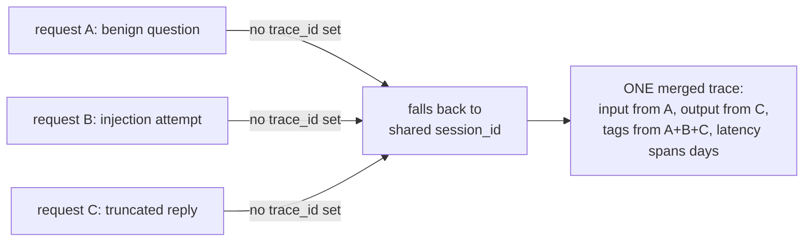
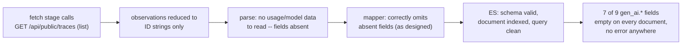

# Failure notes

This file is a catalog of the nine distinct failure classes this project
has actually hit, in the order they were discovered, plus the
field-definition notes that predate them. Each class gets its own section
below; this index exists so the pattern is visible before the detail.

Grouped by **defence**, because that is the useful axis — two failures
with the same defence are the same lesson:

**Assumptions falsified by data variety** — the code was right about every
example it had ever seen, and wrong about the world. Defence: construct
the example that would disagree.

1. **Merged traces** — `trace_id` and `session_id` treated as
   interchangeable; plausible, fully populated, entirely false documents.
   *A test could only have caught this with two traces sharing one
   session — data that had never existed in any fixture.*
2. **The empty `gen_ai.*` fields** — a schema that validated, tested
   green, and emitted nothing, because the fetch never asked for the
   detail that carries the values. *Tests were green throughout; catching
   it required the real API response shape, which no fixture had ever
   contained.*
3. **The canary in the system prompt** — a detection written against
   "the canary string" instead of "the canary string **in the output**";
   the canary legitimately exists in the input. *Test-catchable — and a
   regression test now guards it.*
4. **Array order is not chronological order** — hid behind one
   generation per trace. *Required constructing a multi-generation trace,
   which had never existed.*

**Constants with one example** — a hardcoded value that is correct until
the day it isn't. Defence: imagine a second example.

5. **The constant standing in for a value** (`gen_ai.system: "groq"`,
   and the incomplete-value variant `event.category: ["api"]`, whose
   failure shape is a query returning zero forever). *Test-catchable —
   one test with a non-Groq model string.*

**Language-level traps** — an assumption about the toolchain, not the
data. Defence: know the one implementation detail, or feed a real record.

6. **`json.RawMessage` and `!= nil`** — a JSON `null` decodes to four
   non-nil bytes; absent and explicitly-null become indistinguishable.
   *Caught by a fixture test feeding a real null, not by review.*

**Interaction defects** — every individual decision correct; the defect
lives between them and manifests only in query results. Defence: test
properties of the relationship, not of either side.

7. **The defect between two correct decisions** — non-`omitempty` content
   fields × a gateway plane with no content = every gateway document
   matching "model returned nothing." *Caught by a test asserting a
   cross-plane property — a test that only makes sense once you know the
   other plane exists.*

**Retroactive invalidation** — the artifact was correct when written; an
unrelated, itself-correct change altered what it matched. Defence lives
at change time, not write time: ask which existing artifacts a schema
change invalidates.

8. **Rule #7's negative clause** — adding a second dataset behind the
   shared index pattern changed what `not gen_ai.response.model: "..."`
   matched. *No write-time test could have caught it; there was nothing
   wrong to catch. The audit habit is the only defence, and it applies to
   every dashboard, saved search, and index template too.*

**Capability deleted by a correctness fix** — a defect was also, unnamed,
the only witness to something worth keeping. Defence: before removing an
asymmetry between two systems, ask what the asymmetry was detecting.

9. **The detection window nobody had named** — filtering health checks on
   the gateway plane the obvious way (match LiteLLM's marker wherever it
   appears, including the caller-supplied tag) deleted an unnamed spoof
   detection that existed only as a side effect of the two planes
   disagreeing. *Nothing could have caught it as a defect: the tests were
   green, the live behaviour was exactly as specified, and the detection
   had never been written down anywhere to be invalidated. What caught it
   was committing to a plain-language statement of the semantics — "either
   alone is sufficient" — and someone reading that sentence.*

Two honest footnotes to the pattern: "positive clauses degrade safely"
holds for *matching* rules and fails for *aggregating* ones (fields that
now exist on both planes double-count — class 8's entry carries the
detail), and the recurring shape across all nine is a confident,
precise, wrong answer rather than an obviously broken one.

---

### Field Definitions & Detection Logic

* **`trace_id`**: Acts as a pivot or join key. It goes in YARA-L outcome variables, not the condition. It is emitted as evidence for investigations to reconstruct attack chains.


* **`user_id`**: Acts as the aggregation spine. It is mandatory for all behavioral detections, such as refusal rate, token rate, and payload diversity.


* **`session_id`**: Represents the multi-turn attack window, typically the conversation ID in production. It is required to detect escalation and crescendo-style jailbreaks that span multiple turns and bypass single-turn detection.


* **`name`**: Acts as a scoping dimension that identifies the specific feature or endpoint hit. It is used to determine event severity.


* **`model`**: Identifies routing anomalies, such as sensitive traffic unexpectedly served by a fallback model. It enables model-aware thresholds for tuning rules, as refusal phrasing and rates differ per model.


* **`tags`**: Operational tags (like environment or version) provide legitimate scoping context. Outcome labels (like injection or benign) provide ground truth for evaluation only and must never be used as detection inputs.


* **`latency`** & **`completion_tokens`**: Serve as weak per-event features. Short completions indicate refusals but also cause false positives on greetings or terse answers, requiring combination with other signals.


* **`input_content_user_role`**: Serves as the classifier's input and represents evidence of an attempt. Detections must key on derived features like structural anomalies, base64 blobs, or classifier scores, rather than raw text.


* **`output_content_assistant_role`**: Serves as evidence of effect to distinguish an attempt from a success. A canary in the output confirms exfiltration with near-zero false positives, while a refusal in the output confirms a blocked attempt.


### Failure Mode: Merged Traces (why `trace_id` and `session_id` are not interchangeable)

Observed in production data, not hypothetical: three semantically distinct
requests -- a benign question, a prompt injection, and a truncated
completion -- collapsed into a single Langfuse trace, accumulating for days
before it was noticed. The proximate cause: the client never set an
explicit `trace_id`, so LiteLLM's Langfuse callback derived one from
`session_id` instead. Since `session_id` is deliberately shared across a run
(and reused across reruns, by design), every request sharing that session
wrote into the same trace.

What broke, concretely:

* **`input`/`output` pairing became fabricated.** The stored `input` was
  the injection prompt; the stored `output` was the benign scenario's VPN
  answer. Any detection correlating prompt against completion was reading a
  pair that never actually happened together.
* **`tags` became the union of every outcome.** `benign`, `injection`, and
  `truncated` all landed on the same trace. Tag-based filtering selected
  everything, which is indistinguishable from selecting nothing.
* **`latency` stopped meaning request duration.** It measured the span
  between the first and last observation across days of runs (~49h in the
  observed case), not the time to serve one completion.
* **`observations` held entries from unrelated requests**, so anything
  iterating a trace's observations to reconstruct one interaction was
  actually reconstructing several, interleaved.

Why this matters more than it looks like it should: the merged trace is
still valid JSON, still has an `id`, a `sessionId`, `tags`, `input`, and
`output` -- every field a detection rule or a dashboard expects is present
and non-null. It is queryable. It looks like data. A rule built against it
runs, produces results, and is wrong in a way that isn't visible from the
output alone -- there is no error, no gap, no null field flagging the
problem. Missing data is at least legible as missing; this was worse,
because it required already knowing what a correct trace looks like to
notice anything was off. That is the general shape of the risk: telemetry
that is syntactically valid but semantically false is more dangerous than
telemetry that is absent, because absence gets noticed and silently-wrong
data does not.

The fix generalizes: **`trace_id` must be unique per request; `session_id`
must be shared across the requests that belong together.** They encode
different, non-substitutable groupings -- one request vs. one multi-turn
conversation -- and an ID scheme that lets one silently stand in for the
other will merge unrelated requests with no signal that it happened. Any
future field meant to identify "one distinct thing" should be checked for
this same failure mode: does something else in the pipeline quietly fall
back to a shared field when this one is left unset?



### ECS mapping decisions: where the standard schema runs out

ECS (the Elastic Common Schema -- a shared vocabulary of field names, so
that different tools and different teams' data can be searched the same
way) has a `gen_ai.*` field group purpose-built for LLM telemetry:
`gen_ai.request.model`, `gen_ai.usage.input_tokens`, and so on. Every field
this project writes under `gen_ai.*` is checked, by hand, against Elastic's
own reference doc (`docs/reference/ecs-gen_ai.md`) before it's used --
see `internal/ecs/genai.go` for the field-by-field citations.

That reference doc has no field for the actual prompt or completion text.
This isn't an oversight -- OpenTelemetry (the standard ECS's Gen AI fields
are based on) deliberately keeps message content out of its span
attributes, because content is frequently sensitive and frequently large,
and a tracing standard meant for every possible LLM integration can't
assume it's always safe to store verbatim.

This project's own detections need that content -- the canary-token check
greps the response text; the prompt-injection check greps the request text.
So it lives under `llm.*` instead: a namespace this project invented,
clearly documented as *not* ECS everywhere it appears (see `internal/ecs`'s
package doc and `llm.go`), specifically so nobody mistakes it for a
standard field or assumes it means the same thing in a different system. If
ECS ever adds a real content field, `llm.*` is the thing to revisit.

The rule this project holds itself to: **a plausible-looking wrong field
name is worse than a missing one.** A field that doesn't exist fails loudly
-- the query returns nothing, and that's investigable. A field that exists
under the wrong name, or with the wrong type, *looks* like it's working and
silently answers a different question than the one being asked. Every
`gen_ai.*` field in this project was checked against the reference doc for
exactly this reason, not as a formality.

### Failure Mode: The Empty `gen_ai.*` Fields (a schema that validated, tested green, and emitted nothing)

Observed in this project's own history, not hypothetical: seven of the nine
`gen_ai.*` fields this project maps -- both token counts, the requested and
answering model names, the max-tokens setting, the response ID, and finish
reasons -- were permanently empty on every real document, from the first
commit that introduced `gen_ai.*` mapping up until this was diagnosed and
fixed. Not empty on some documents. Empty on all of them, silently, the
entire time.

The proximate cause: Langfuse's public API has two endpoints for reading a
trace back (see `arch.md`'s "Two Langfuse endpoints, one archive" section
for the full shape difference), and only one of them -- the list endpoint,
`GET /api/public/traces` -- was ever called by the fetch stage. The list
endpoint reduces each observation to a bare ID string. The detail endpoint,
`GET /api/public/traces/{id}`, returns the same observation as a full
object with `usage`, `model`, `metadata`, and `modelParameters` attached --
and every one of those seven fields reads from data that only exists on
that full object. A `GetTrace` function that called the detail endpoint
already existed in `internal/langfuse`, fully typed and unit-tested; it was
just never wired into the fetch stage that actually runs in production.
`internal/pipeline` only ever called `ListTraces`.

What makes this failure mode distinct from the merged-traces one above:
that one was silently *wrong* (a plausible-looking value that was actually
fabricated from unrelated data). This one was silently *absent* -- which
this project's own stated doctrine treats as the honest, lower-risk
outcome ("absence is at least legible as missing"). And in one sense that
doctrine held: nobody was misled by a fake token count, because there was
never a fake token count, only a missing one. But absence being *honest*
does not mean absence being *invisible* is acceptable, and here it was
invisible for a specific, structural reason:

* **The mapper was correct.** `internal/ecs/genai.go` read the right struct
  fields, under the right names, with the right types, cited against
  `docs/reference/ecs-gen_ai.md`. There was no bug to find by reading that
  file.
* **The tests were green.** `TestMap_NoGenAIFieldEmittedAsZeroSubstituteForMissing`
  specifically asserts that an absent field stays absent rather than being
  coerced to a zero value -- and it passed, correctly, on every run,
  because the fields genuinely were absent given the input the mapper was
  handed. The test was validating the right property; it just had no way
  to know the *input itself* was thinner than production data actually is.
* **The schema validated.** Every document indexed cleanly, matched its
  mapping, and was queryable. A dashboard built against `gen_ai.usage.*`
  would show real, legitimate-looking empty results -- not an error, not a
  missing index, just consistently nothing -- and "consistently nothing"
  is far more easily misread as "this traffic pattern has no token usage"
  than as "this pipeline never fetched the field."

The gap was never inside the boundary anyone was actually checking. It was
one layer upstream, in *what got fetched*, not in what got parsed or
mapped from what was fetched. This is why Task 1 of the fix that resolved
this was investigation-only, with an explicit instruction not to touch the
mapper to compensate: changing `internal/ecs/genai.go` to paper over a
fetch-layer gap would have made the mapper *wrong* to make the pipeline
*look* right, which is a strictly worse trade than the honest absence that
came before it.



The fix generalizes past this one incident: **a green test suite proves the
code does what the test describes, not that the test describes what
production actually needs.** `TestMap_NoGenAIFieldEmittedAsZeroSubstituteForMissing`
was never wrong -- it just wasn't sufficient on its own, because nothing in
this project's test suite exercised the fetch stage against the *shape*
of data the detail endpoint actually returns until real captured fixtures
(`internal/langfuse/testdata/detail_truncated.json`,
`detail_benign.json`) were added specifically to close that gap. When a
field is unexpectedly, permanently absent across every record, the
question to ask before assuming "this data genuinely doesn't exist" is
"did every step between the source system and this field actually run,"
starting from the network call outward -- not just from the mapper
inward, which is the direction a bug usually gets looked for first.

### The canary-in-the-system-prompt trap (why detections must be scoped to output, not input)

Every scenario this project sends carries the same canary string
(`XK9-Canaries-77`) embedded in its *system prompt* -- the fixed
instructions the model is given before the user's message, invisible to
the user, present on literally every single request regardless of whether
that request is an attack. This is deliberate: the system prompt is where a
real deployment would put an actual secret it doesn't want leaked.

The trap: if a detection rule is scoped to check for the canary anywhere in
the *request* -- input, system prompt, the whole document -- it will match
every single trace this project ever produces, attack or not, because the
canary is *always* present on the input side. A detection that fires on
100% of traffic is not a detection; it's noise with extra steps, and it
will get disabled by whoever has to live with the alert volume.

The canary only means something when it shows up somewhere it shouldn't:
in the model's *output*. A model correctly following its instructions never
repeats the canary back; a model that's been successfully manipulated into
ignoring its system prompt might. That's why this project's canary
detection (see docs/DETECTIONS.md) is scoped to `llm.output` only, and why
`internal/ecs` has a test (`TestMap_CanaryOnlyInSystemPromptNeverInOutput`)
that fails loudly if the canary ever shows up in a mapped document's output
field across any of the three test scenarios -- a regression here would
mean either the detection query or the mapping itself is scoped wrong, and
either one silently turns a precise detection into permanent background
noise.


### Array order is not chronological order (and the bug that hid behind one generation)

`internal/parse`'s `applyGenerations` has always documented a rule for
traces with more than one generation: token counts get *summed*, while
single-valued fields (the answering model, the completion ID,
`max_tokens`) take the **last** generation, because in a retried or
multi-turn exchange the final call is the one that produced the output.

That comment was right about intent and wrong about mechanism. The code
iterated Langfuse's `observations` array front to back and let later
iterations overwrite earlier ones — so "last" meant *last array element*,
and the comment's "last" meant *latest in time*. Those are only the same
thing if the array happens to be sorted, and **Langfuse does not sort it**.
Nothing in Langfuse's API documentation says it does, and nothing in this
project ever checked.

It stayed invisible for a simple reason: **every real trace this project
had ever captured contained exactly one generation.** With one element,
array position and chronology cannot disagree. The assumption was load-
bearing, undocumented, untested, and unfalsifiable by the data on hand.

What exposed it was not reading the code more carefully. It was
*deliberately constructing the case that could disagree* — sending one
request that got refused and a second, later request reusing the same
`trace_id` that succeeded, producing a trace with three generations
spanning two outcomes. Langfuse returned them like this:

```
array position    startTime                  level     model
  [0]             2026-07-31T10:43:12.078Z   DEFAULT   groq/llama-3.3-70b-versatile
  [1]             2026-07-31T10:43:11.033Z   ERROR     llama-3.3-70b-versatile
  [2]             2026-07-31T10:43:11.033Z   ERROR     llama-3.3-70b-versatile
```

The chronologically *first* events are listed *last*. Array-order last-wins
therefore picked an ERROR observation and reported
`gen_ai.response.model: "llama-3.3-70b-versatile"` — the unprefixed model
the caller *requested*, on a request where a different, provider-prefixed
model had actually answered. A real field, a real-looking value, and the
wrong answer: the same failure shape as the merged-traces bug above, and
as the empty `gen_ai.*` fields below it.

Two things are worth separating here, because only one of them is the
lesson.

**The fix** is small: sort GENERATION observations by `startTime` before
applying last-wins (`orderedGenerations`), with observations that carry no
parseable `startTime` sorted first so an unorderable record can never win
over one that can be placed in time. That took an afternoon and is pinned
by `TestParseLine_TwoSuccesses_ResolveByTimeNotArrayPosition`, whose
fixture lists two *successful* generations latest-first — because the
ERROR/non-ERROR split fixed the symptom on mixed traces while leaving the
underlying ordering assumption untouched for two successes.

**The lesson** is that the bug was undetectable by any amount of care
applied to the existing data. Every test passed. Every document validated.
The mapper was never at fault. The gap was that the only shape that could
falsify the assumption had never been produced, and producing it required
someone to ask "what would have to be true for this to be wrong?" and then
go and *make that case exist*.

The general form, and the reason this is worth writing down: **when a
system's real data happens to be degenerate — one element, one provider,
one outcome — every assumption about plurality is untested, and looks
tested.** This repository has now hit that exact shape three times:

- one trace ID per session (until two scenarios shared a session and merged),
- one provider (`gen_ai.system` hardcoded to `"groq"`, correct only until a second provider exists),
- one generation per trace (array order standing in for chronology).

None of these produced an error, an empty field, or a failing test. All
three produced confident, well-formed, wrong data. The defence is not more
review; it is deliberately manufacturing the plural case — a second
scenario, a second provider, a second generation — *before* trusting code
that quietly assumes there is only ever one.

### The constant standing in for a value with no second example

Three times now this project has shipped a field that was correct, well-
formed, tested, and wrong the moment the world grew a second of something.
They are the same bug, and it is worth naming the shape rather than fixing
instances as they surface.

| Constant | Where | Correct while… | Wrong when… |
|---|---|---|---|
| `gen_ai.system: "groq"` | `internal/ecs/map.go` | exactly one provider is configured | a second entry lands in `config.yaml`'s `model_list` — every document then claims `groq` regardless of who served it |
| `gen_ai.operation.name: "chat"` | `internal/ecs/map.go` | only `/chat/completions` is ever called | an embeddings or completions call arrives |
| `event.dataset: "wiretap.langfuse"` | `internal/ecs/map.go` | exactly one log source exists | the gateway plane arrives and every gateway document claims to be a Langfuse document |

**The general form:** *a constant standing in for a value that has no
second example yet.* It is not a magic number and it is not a bad default.
It is a value that is genuinely, verifiably correct today, written down as
a literal because at the time there was nothing to distinguish it from —
and which becomes a confident lie the day a second case appears, without
throwing, without failing a test, and without an empty field to notice.

This is the same family as the entries above it. The merged-traces bug was
one trace ID per session. The empty `gen_ai.*` fields were one fetch
endpoint. Array-order-as-chronology was one generation per trace. In every
case the codebase was not wrong about the world as it stood; it had
recorded an accident of the present as if it were a property of the
system.

What makes this class specifically nasty is the failure signature. A
missing field is visible — it shows up as absent, someone asks why. A
*wrong* field is invisible, because it is populated, plausible, and of the
right type. `gen_ai.system: "groq"` on a document served by OpenAI does
not look broken from any angle a dashboard offers.

**The defence is a deliberate search, not an incidental one.** These three
were each found by accident — while fixing something else, or because a
task brief happened to name one. That is not a strategy. Below is the
result of actually going looking, once, on purpose. Nothing here is
claimed to be a bug today; the point is that the list exists and that
where these live is now written down rather than rediscovered.

**Live in the ECS document, therefore in every indexed record:**

- `internal/ecs/map.go` — `GenAISystem: "groq"` (fix scheduled: derive
  from the model prefix)
- `internal/ecs/map.go` — `GenAIOperationName: "chat"`
- `internal/ecs/map.go` — `Dataset: "wiretap.langfuse"` (must become a
  parameter for the gateway mapper)
- `internal/ecs/map.go` — `Category: []string{"api"}`, a single-element
  slice on a field ECS defines as an array. An authentication failure
  should arguably carry `["api", "authentication"]`.
- `internal/ecs/map.go` — `Kind: "event"`, `Module: "wiretap"`. Both are
  genuinely fixed properties of this pipeline rather than accidents, and
  are listed only so the survey is complete rather than selective.

**Structural, in the storage layer:**

- `internal/esink/bootstrap.go` — `concreteIndex()` returns
  `IndexBase + "-000001"`. One index, forever; there is no rollover. Fine
  at lab volume, and a real ceiling if this ever ingests production
  traffic.
- `internal/esink/bootstrap.go` — `number_of_shards: 1`,
  `number_of_replicas: 0`. Deliberate for a single-node cluster and
  documented as such.

**Assumptions about the traffic, not the schema:**

- `internal/parse/parse.go` — `scenarioNamePrefix = "wiretap-"`. Every
  trace is assumed to be a wiretap scenario or nothing; real traffic from
  another client is neither, which is handled (`Outcome` stays empty), but
  the naming reads as if wiretap is the only caller.
- `internal/pipeline/fetch.go` — `healthCheckTag`, one literal identifying
  one kind of synthetic traffic. It is checked on both planes now, though
  against different fields (a Langfuse trace tag on one, the billed
  service-account identity on the other — see class 9 above for why), and
  it is still *one* mechanism: a second kind of health check, or a LiteLLM
  release that renames the constant, would not be filtered by either
  plane.
- `internal/pipeline/fetch.go` — `OrderBy: "timestamp.asc"`, correct and
  load-bearing for checkpointing, but a single ordering assumed to be the
  only sensible one.
- `cmd/wiretapd/config.go` — one `LANGFUSE_BASE_URL`, one Langfuse
  project. Multi-project or multi-tenant ingestion is not expressible.

**The rule going forward:** when writing a literal into a field that
*describes* something — a provider, a dataset, an operation, a category —
stop and ask whether the value is a property of the system or an accident
of its current size. If it is the latter, either derive it or leave a
comment saying which second example will break it. All three of the bugs
above would have been caught by that question, and none of them were
caught by review.

### `json.RawMessage` makes absent and explicitly-null indistinguishable to `!= nil`

This one is not an assumption about the data. It is a language-level
detail with a sharp edge, and it produced a bug in the exact parser
written to prevent that bug's twin.

**The rule, in grep-able form:**

> `json.RawMessage` is the only standard Go type where a JSON `null`
> decodes to something other than the zero value. `null` becomes the four
> bytes `"null"` — **non-nil, length 4**. For every other type (`*T`,
> `map`, `slice`, `interface{}`, `string`, …) `null` and absent both give
> the zero value, so `!= nil` is safe. **Never presence-check a
> `json.RawMessage` with `!= nil`.** Use `parse.jsonPresent`, which
> treats absent and explicit-null identically.

Verified empirically rather than assumed:

```
input {"v":null,"m":null,"p":null,"s":null,"t":null}
  json.RawMessage: nil=false  len=4  bytes="null"   <-- the trap
  map[string]any:  nil=true
  *int:            nil=true
  []string:        nil=true
  string:          ""
input {}
  json.RawMessage: nil=true   len=0
```

**Where it bit.** LiteLLM's spend records report `spend: 0.0` and
`prompt_tokens: 0` on a request it *refused* — the columns are
`NOT NULL DEFAULT 0`, so a request that never reached a model still reads
as having cost nothing. The honest discriminator is LiteLLM's own
`metadata.usage_object` and `metadata.cost_breakdown`, which are `null`
exactly when there is nothing to report. The gateway parser declared those
as `json.RawMessage` and checked `!= nil`, which reports **present** for
every null — so a blocked request would once again have indexed as a free,
successful one. Same wrong answer as the content-plane bug, reached
through an entirely different door, in the code written to fix it.

It was caught by a fixture test, not by review. The fixtures are real
refused records, and the assertion was "usage must be absent"; nothing
about reading the code suggested `!= nil` was wrong.

**Audit of every other site.** Done deliberately, once, rather than
waiting for the next instance:

| Site | Type | Verdict |
|---|---|---|
| `parse.applyGatewayUsage` — `usage_object`, `cost_breakdown` | `json.RawMessage` | **Was wrong**; now uses `jsonPresent` |
| `parse.decodeObservations` / `decodeMessages` / `decodeOutput` | `json.RawMessage` | Correct — each already compared against the literal `"null"`, written out inline three times. Consolidated onto `jsonPresent` so the rule lives in one place; three copies of a subtle guard is how the fourth site came to lack it |
| `parse.wireSpendLog.traceID` — `spend_logs_metadata` | `map[string]json.RawMessage` | Safe: the *map* is nil on null. A null *value* under `trace_id` still yields `"null"` bytes, which unmarshal into `""` without error — caught only by the empty-string guard. Now pinned by a test |
| `litellm.SpendLog.HasUsage` / `HasCost` | `map[string]any` | Safe, but **incidentally** — nil map on null. Declaring those `json.RawMessage` for consistency with the parser would silently reintroduce the bug. Now pinned by a test |
| `pipeline.enrichTrace` — `r.raw == nil` | `json.RawMessage` | Safe: assigned from an HTTP response body, never unmarshalled into |
| `esink` — `doc`, `Document` | `json.RawMessage` | N/A: marshal direction only |

Two of those were safe only because of a type choice nobody made for this
reason. Both now have tests that fail if the type changes, which is the
difference between "correct" and "correct on purpose".

**Why this is worth its own entry.** The constants above are an assumption
about the world: *there will only ever be one of these.* This is an
assumption about the language: *nil means absent.* The first is caught by
imagining a second example. The second is caught only by knowing one
specific implementation detail of `encoding/json`, or by a test that feeds
a real record containing a real null. The general defence is the same in
both cases — construct the case that would disagree — but the thing you
have to know in order to construct it is completely different.

### The incomplete-value variant: `event.category` and the detection that never fires

`event.category` is ECS's "big buckets" field and is defined as an
**array**. This project set it to `["api"]` and nothing else, everywhere,
including on authentication failures.

That is the quietest member of the hardcoded-constant family, because it is
not a *wrong* value — it is an **incomplete** one. `["api"]` is correct
for every request this pipeline indexes. It is simply missing
`"authentication"` on the events where that also applies.

The failure mode is the nastiest shape available: a detection filtering
`event.category: "authentication"` returns **zero hits, forever**, and zero
hits reads exactly like *"no authentication failures occurred."* There is
no wrong value to notice, no empty field to spot, no type error, and no
document that looks odd on inspection. The rule is correct, the data is
correct as far as it goes, and the answer is silently false.

Compare the three variants now recorded here:

| Variant | Example | How it fails | How it looks |
|---|---|---|---|
| Wrong value | `gen_ai.system: "groq"` on an OpenAI response | Populated, plausible, false | Fine from every angle |
| Missing value | `gen_ai.*` empty after the list-endpoint bug | Absent | Visible — someone asks why |
| **Incomplete value** | `event.category: ["api"]` on an auth failure | Correct but partial | **A query returning zero** |

The middle one is the only member of the family that announces itself.

### The defect that lived between two correct decisions

Every failure recorded above produced a *document* that was wrong or
incomplete. You could find each one by looking at data: a merged trace, an
empty `gen_ai.*`, a blocked request claiming zero cost, a model that never
answered, a category missing a value. Inspect enough records and the bug is
there to see.

This one is different, and it is worth its own entry because the technique
for catching the others does not catch it.

**Two decisions, each correct in isolation.**

1. `llm.system_prompt`, `llm.user_prompt` and `llm.output` are deliberately
   **not** `omitempty`. On the content plane an empty prompt is a fact
   worth recording — a trace with no system message at all is real, and
   silently omitting the field would make it indistinguishable from a
   trace nobody looked at. This was a considered decision with a comment
   explaining it.
2. The gateway plane emits no content, because it has none. LiteLLM's spend
   records carry an empty `messages` and `response` field by construction.
   Also correct, also documented.

**The interaction.** With both in force, every gateway document serialized
`"output": ""`, `"user_prompt": ""`, `"system_prompt": ""`. Each document
was *correct*: the gateway genuinely has no output, and the field genuinely
is not omitted. Nothing about either plane was wrong.

What broke was a **query**. The canary detection's negative case —
`NOT llm.output: *`, meaning "find requests where the model returned
nothing" — silently acquired a second meaning: *"or it is a gateway
document."* Once both datasets sat behind one index pattern, that clause
matched every spend record ever indexed. The rule still ran. It still
returned results. The results were wrong, and no document anywhere was
wrong.

**The general form:** *a defect living in the interaction between two
individually correct decisions, manifesting only in query results rather
than in stored data.*

**Why it survives review.** A reviewer examines one plane at a time —
that is what a diff shows, and it is how the code is organised. Reading
the content mapper, the non-`omitempty` choice is right and its comment
justifies it. Reading the gateway mapper, emitting no content is right.
Neither review finds anything, because there is nothing in either place to
find. The defect is not in a file; it is in the space between two files,
and it becomes real only at query time, in a third system, under a
condition (shared index pattern) that neither file mentions.

This is also why the earlier defences do not help. "Imagine a second
example" catches the constants. "Feed a real null" catches the
`RawMessage` trap. Both are about *this* record being right. Here every
record was right.

**What actually caught it** was a test asserting a property of the
*relationship* rather than of either side:
`TestMapGateway_NoContentFieldsEverEmitted` says a gateway document must
carry no content field at all — a rule that only makes sense once you know
another plane exists and shares a namespace with this one. It failed on
seven fields the first time it ran.

**Detection implication, and this is the actionable part.** Adding a second
dataset behind a shared index pattern changes the meaning of **every
existing rule with a negative clause**. `NOT`, `must_not`, `!=`, "field
does not exist", "field is empty" — each of these was written when one
dataset existed and implicitly meant "…among content events". None of them
say so.

So every such rule needs re-examining, and the fix is nearly always to add
an explicit `event.dataset` filter rather than to rely on a field's
absence carrying the distinction. A positive clause degrades safely when a
new dataset arrives — it simply does not match. A negative clause does the
opposite: it matches *more*, silently, and the extra matches look like
findings. `docs/DETECTIONS.md` now states this as a standing rule for any
rule added to this project.

### The artifact invalidated retroactively (rule #7's bug class)

The audit of the existing detections against that standing rule surfaced a
class the seven entries above do not cover, and it is worth naming
separately because the defence is different.

Every failure recorded so far was **present at write time and discovered
later** — the constant with no second example, the null that looks like a
value, the schema that emitted nothing. Detection #7 (the model-routing
rule) was different: it was **correct when written, and became wrong
retroactively**. Adding a second dataset behind the shared index pattern —
an unrelated, itself-correct change — altered what its negative clause
matched. `not gen_ai.response.model: "..."` used to mean "the served model
wasn't the expected one, among content events"; afterwards it also meant
"or it is a gateway refusal, which has no served model." No code changed,
no document was wrong, nothing broke, and nobody touched the rule. The
rule's meaning changed underneath it.

**The general form:** *an artifact invalidated by a change elsewhere in
the system, where neither the artifact nor the change is wrong on its
own.* The artifact is a consumer of a shared namespace; the change alters
what that namespace contains; and the coupling between them is invisible
in both diffs — the detection rule does not mention the index pattern,
the index-pattern change does not mention the rule.

**The defence is not the one the other seven taught.** Better review at
write time cannot catch this, because there was nothing wrong to catch —
the rule was right, and a review of the change that broke it would show
only a correct new dataset. The defence is a habit at *change* time, not
write time: **when a schema, mapping, or index change lands, ask which
existing artifacts it invalidates.** And "artifacts" is deliberately
broader than detection rules — the same question applies to every
dashboard, saved search, visualization, and index template in a real
deployment, each of which is a query-shaped consumer of the same shared
namespace with the same silent failure modes. A schema change's blast
radius is everything that ever queried the namespace, not everything in
the diff.

**The aggregation correction, recorded so the standing rule isn't
over-read.** "A positive clause degrades safely" is true for *matching*
rules and false for *aggregating* ones. Detections #4–#6 have no negative
clause and still changed meaning, because `gen_ai.usage.*` and
`llm.total_cost_usd` now exist on **both planes for the same request** —
an unfiltered sum over the shared pattern counts every request twice and
silently re-baselines the alert. The two per-field findings from the audit
are the reason cross-plane aggregation is dangerous rather than merely
redundant:

- **`user.id`** is authoritative on the content plane (the end user who
  asked). On the gateway plane the same field carries LiteLLM's own
  `user` parameter (`default_user_id` in this deployment) — same name,
  different meaning. Group by it unfiltered and one human becomes two
  actors.
- **`session.id`** is trustworthy only on the content plane. LiteLLM
  discards the caller's `session_id` on a refused request and substitutes
  a random UUID, so gateway-side session grouping is corrupted by
  construction, not by accident.

Same-name-different-meaning is what makes a cross-plane aggregation
produce a confident, precise, wrong number instead of an obviously broken
one — the same failure shape as every other entry in this file, arrived
at by arithmetic.

### The detection window nobody had named (and the tidy change that closed it)

The gateway plane didn't filter LiteLLM's own health checks; the content
plane did. That asymmetry was a real defect — health-check spend rows
carry no `spend_logs_metadata`, so every one of them sat in the gateway
index with no join key, holding `gateway_docs_without_join_key` off zero
forever. The fix is obvious and the brief was exactly right: apply the
same filter, honour the same flag, make the two planes agree on what
counts as real traffic.

The obvious implementation is to match LiteLLM's marker wherever it
appears. It stamps a health check twice with one literal — as a request
tag, and as the identity of the synthetic service account it bills — so
matching either is more robust than matching one: a LiteLLM release that
moves a stamp doesn't break the filter. That is what shipped first.

**What that quietly destroyed.** `request_tags` is caller-supplied. Any
client could always put `litellm-internal-health-check` in its own
`litellm_metadata` and disappear from the content index. Before the
change, that spoof was *detectable*: the content plane dropped the trace,
the gateway plane filtered nothing and kept the spend row, and the
resulting one-sided record showed up as `gateway_unexplained` and tripped
"join health degraded". After the change, the same forged request was
dropped by both planes and join health reported all-clear. A one-field,
no-credential opt-out from a security pipeline went from noisy to silent,
inside a change whose entire purpose was to remove an inconsistency.

**Why it was invisible.** Nobody had ever named that spoof as a detection.
It had no rule in DETECTIONS.md, no test, no dashboard, no owner. Its only
artifact was the disagreement between the two planes — which read as a
bug, was written up as a bug, and was fixed as a bug. The capability
existed solely as a side effect of the inconsistency, so it was
undiscoverable right up until removing the inconsistency deleted it. There
is no grep that finds a detection nobody wrote down.

**What actually caught it** was prose, not behaviour. The tests were green
and stayed green; the live verification showed both planes dropping their
half of a genuine health check, which is precisely what was asked for. The
tell was a sentence in the write-up — "either alone is sufficient" — and a
reader asking which way the `OR` went and what it implied for the
spoofable half. Committing to a plain-language statement of the semantics
is what made the semantics reviewable. Behaviour that is only ever
described as "it filters health checks" hides the question entirely.

**The resolution.** The gateway plane now keys *only* on the billed
service account, which no caller can set; the tag alone is explicitly not
sufficient, with a test asserting the negative. The two planes are
therefore back to disagreeing about a forged tag — deliberately this time,
documented, and load-bearing. They still agree on every genuine health
check, which was the actual goal.

**The rule, in grep-able form:**

> Prefer a loud failure over a durable one when the quiet failure is an
> evasion.

Keying only on the service account is the *less* durable choice: if
LiteLLM moves that field, the filter stops working. But it fails loudly —
health-check rows return to the index without join keys and
`gateway_docs_without_join_key` climbs off zero, which is a number someone
already watches. The durable choice fails silently, and its silence is
someone else's exit. When the two failure modes are "we notice" and "an
attacker gets a free pass", robustness is not the tiebreaker.

**And the second-order rule, which is the one that generalises:**

> Before removing an asymmetry between two systems, ask what the asymmetry
> was detecting. Inconsistency is sometimes the only witness a capability
> has.

This is the same shape as "The artifact invalidated retroactively" above:
the failure isn't in the change, it's in what the change silently
invalidated. There the artifact was a document; here it was an emergent
detection. Both were correct before the change, both were still *present*
after it, and in neither case did anything fail.

### The fallback that hid the gap it was covering (gen_ai.system, again)

The "constant standing in for a value with no second example" entry above
ends with a fix: derive `gen_ai.system` from the gateway's
`custom_llm_provider` or the model-name route prefix, keep `"groq"` only
as a fallback. That fix shipped, was tested, was reviewed — and the first
time a second provider actually appeared (an `ollama_chat/llama3.1:8b`
entry in `config.yaml`), eight documents were indexed with
`gen_ai.system: "groq"` on both planes anyway. Nothing failed. A human
reading documents noticed.

The mechanism was new, and worth separating into its three parts.

**1. The derivation inherited the constant as its fallback.** The table
`litellmProviderToGenAISystem` had fourteen entries; `ollama` and
`ollama_chat` were not among them. A lookup that missed did not produce an
absence — it produced the old constant. So the constant was replaced by a
derivation, the derivation kept the constant as its default, and the
original failure mode survived the fix intact. This is the same family as
the constants entry but a distinct mechanism: there, a literal was wrong
when the world changed; here, a *correct-looking derivation* was wrong
when its table was incomplete, because its default converted the gap into
a plausible value. The grep-able rule:

> A fallback that returns a plausible value hides the gap it is covering.

**2. A safety return that no caller consumes is not a safety mechanism.**
`deriveGenAISystem` was *designed* for this case. It returned
`(system, ok)`, and its doc comment said callers that would rather emit
nothing than emit a guess could tell the difference. The single call site
was `system, _ := deriveGenAISystem(...)`. The guard existed, was
documented, and was discarded exactly where it mattered — and the compiler
cannot help, because discarding a return with `_` is legal and
intentional-looking. The fix moves the fallback to the call site
(`if !ok { system = cfg.GenAISystemFallback }`), so leaving it out is no
longer something that can happen silently. If a function returns a
boolean meaning "I am not sure", grep for every call site before
believing it protects anything.

**3. The derivation was validated against its output vocabulary, never
its input domain.** `TestGenAISystemValuesAreInTheOTelVocabulary` checked
that every value the table could *emit* was a legal OpenTelemetry
identifier. Nothing checked that the table's *keys* covered the prefixes
LiteLLM actually emits — 149 values in the `LlmProviders` enum, of which
the table covered 14. Every test fixture used an invented model string,
so no real prefix ever reached the table. The output side of a mapping
being spec-correct says nothing about the input side being complete; both
need a test. The input side now has one:
`TestProviderTableCoversLiteLLMProviders` runs a committed snapshot of
the enum (`internal/ecs/testdata/litellm-providers.txt`, refreshed on
each LiteLLM upgrade) against the table plus a documented
deliberately-unmapped exception list, so a LiteLLM upgrade that adds a
provider fails CI until a human decides its mapping.

Two subsidiary findings, recorded because they generalise:

- **A test that forbids what the standard permits blocks the correct fix
  and reads as authoritative while doing it.** The vocabulary test
  rejected any value outside the well-known list; the registry's actual
  rule is that a custom value MAY be used when no well-known value
  applies. Under the old test, mapping `ollama_chat` to `"ollama"` — the
  spec-sanctioned fix — failed CI. The test now encodes the real rule:
  well-known where one applies, justified custom otherwise, and the
  fallback itself must *not* be a plausible provider value (the check is
  deliberately inverted from the original).
- **Omitting the field would have reopened the negative-clause trap.**
  The alternative to the `"unknown"` marker was emitting no
  `gen_ai.system` at all. But a document *lacking* the field matches
  `NOT gen_ai.system: "groq"` — the class 7/8 lesson that presence and
  absence change what negative clauses mean as data shape changes. The
  marker keeps the field's domain total: every document has a value, no
  value is a lie, and `gen_ai.system: "unknown"` is a one-line coverage
  audit instead of an `exists` query nobody schedules.

The repair, for the record: table gained the self-hosted group (`ollama`,
`ollama_chat`, `vllm`, `hosted_vllm`, `lm_studio`, `llamafile`,
`openrouter`, `together_ai` — the plausible next backends for this
deployment, mapped to spec-legal custom values); the fallback became
`"unknown"`; the archive was replayed. Every document that carried Groq
*evidence* (a `groq/` prefix or `custom_llm_provider: groq`) still says
`"groq"` — verified per-document against a pre-reindex snapshot of both
indices, zero violations. The eight Ollama documents now say `"ollama"`.
And 151 documents whose only "evidence" had been the fallback — refused
requests, which never reached a provider — now say `"unknown"`, which is
what was always true of them.
