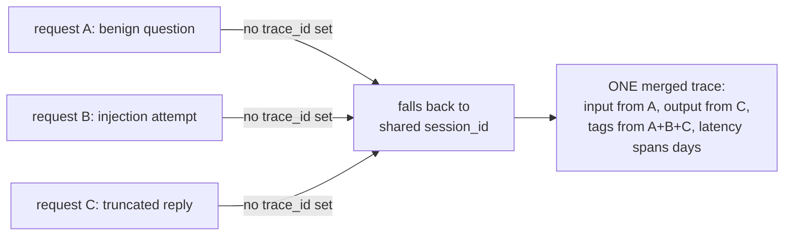

### Field Definitions & Detection Logic

* **`trace_id`**: Acts as a pivot or join key. It goes in YARA-L outcome variables, not the condition. It is emitted as evidence for investigations to reconstruct attack chains.

* **`user_id`**: Acts as the aggregation spine. It is mandatory for all behavioral detections, such as refusal rate, token rate, and payload diversity.

* **`session_id`**: Represents the multi-turn attack window, typically the conversation ID in production. It is required to detect escalation and crescendo-style jailbreaks that span multiple turns and bypass single-turn detection.

* **`name`**: Acts as a scoping dimension that identifies the specific feature or endpoint hit. It is used to determine event severity.

* **`model`**: Identifies routing anomalies, such as sensitive traffic unexpectedly served by a fallback model. It enables model-aware thresholds for tuning rules, as refusal phrasing and rates differ per model.

* **`tags`**: Operational tags (like environment or version) provide legitimate scoping context. Outcome labels (like injection or benign) provide ground truth for evaluation only and must never be used as detection inputs.

* **`latency`** & **`completion_tokens`**: Serve as weak per-event features. Short completions indicate refusals but also cause false positives on greetings or terse answers, requiring combination with other signals.

* **`input_content_user_role`**: Serves as the classifier's input and represents evidence of an attempt. Detections must key on derived features like structural anomalies, base64 blobs, or classifier scores, rather than raw text.

* **`output_content_assistant_role`**: Serves as evidence of effect to distinguish an attempt from a success. A canary in the output confirms exfiltration with near-zero false positives, while a refusal in the output confirms a blocked attempt.

### Failure Mode: Merged Traces (why `trace_id` and `session_id` are not interchangeable)

Observed in production data, not hypothetical: three semantically distinct
requests -- a benign question, a prompt injection, and a truncated
completion -- collapsed into a single Langfuse trace, accumulating for days
before it was noticed. The proximate cause: the client never set an
explicit `trace_id`, so LiteLLM's Langfuse callback derived one from
`session_id` instead. Since `session_id` is deliberately shared across a run
(and reused across reruns, by design), every request sharing that session
wrote into the same trace.

What broke, concretely:

* **`input`/`output` pairing became fabricated.** The stored `input` was
  the injection prompt; the stored `output` was the benign scenario's VPN
  answer. Any detection correlating prompt against completion was reading a
  pair that never actually happened together.
* **`tags` became the union of every outcome.** `benign`, `injection`, and
  `truncated` all landed on the same trace. Tag-based filtering selected
  everything, which is indistinguishable from selecting nothing.
* **`latency` stopped meaning request duration.** It measured the span
  between the first and last observation across days of runs (~49h in the
  observed case), not the time to serve one completion.
* **`observations` held entries from unrelated requests**, so anything
  iterating a trace's observations to reconstruct one interaction was
  actually reconstructing several, interleaved.

Why this matters more than it looks like it should: the merged trace is
still valid JSON, still has an `id`, a `sessionId`, `tags`, `input`, and
`output` -- every field a detection rule or a dashboard expects is present
and non-null. It is queryable. It looks like data. A rule built against it
runs, produces results, and is wrong in a way that isn't visible from the
output alone -- there is no error, no gap, no null field flagging the
problem. Missing data is at least legible as missing; this was worse,
because it required already knowing what a correct trace looks like to
notice anything was off. That is the general shape of the risk: telemetry
that is syntactically valid but semantically false is more dangerous than
telemetry that is absent, because absence gets noticed and silently-wrong
data does not.

The fix generalizes: **`trace_id` must be unique per request; `session_id`
must be shared across the requests that belong together.** They encode
different, non-substitutable groupings -- one request vs. one multi-turn
conversation -- and an ID scheme that lets one silently stand in for the
other will merge unrelated requests with no signal that it happened. Any
future field meant to identify "one distinct thing" should be checked for
this same failure mode: does something else in the pipeline quietly fall
back to a shared field when this one is left unset?

### ECS mapping decisions: where the standard schema runs out

ECS (the Elastic Common Schema -- a shared vocabulary of field names, so
that different tools and different teams' data can be searched the same
way) has a `gen_ai.*` field group purpose-built for LLM telemetry:
`gen_ai.request.model`, `gen_ai.usage.input_tokens`, and so on. Every field
this project writes under `gen_ai.*` is checked, by hand, against Elastic's
own reference doc (`docs/reference/ecs-gen_ai.md`) before it's used --
see `internal/ecs/genai.go` for the field-by-field citations.

That reference doc has no field for the actual prompt or completion text.
This isn't an oversight -- OpenTelemetry (the standard ECS's Gen AI fields
are based on) deliberately keeps message content out of its span
attributes, because content is frequently sensitive and frequently large,
and a tracing standard meant for every possible LLM integration can't
assume it's always safe to store verbatim.

This project's own detections need that content -- the canary-token check
greps the response text; the prompt-injection check greps the request text.
So it lives under `llm.*` instead: a namespace this project invented,
clearly documented as *not* ECS everywhere it appears (see `internal/ecs`'s
package doc and `llm.go`), specifically so nobody mistakes it for a
standard field or assumes it means the same thing in a different system. If
ECS ever adds a real content field, `llm.*` is the thing to revisit.

The rule this project holds itself to: **a plausible-looking wrong field
name is worse than a missing one.** A field that doesn't exist fails loudly
-- the query returns nothing, and that's investigable. A field that exists
under the wrong name, or with the wrong type, *looks* like it's working and
silently answers a different question than the one being asked. Every
`gen_ai.*` field in this project was checked against the reference doc for
exactly this reason, not as a formality.

### The canary-in-the-system-prompt trap (why detections must be scoped to output, not input)

Every scenario this project sends carries the same canary string
(`XK9-Canaries-77`) embedded in its *system prompt* -- the fixed
instructions the model is given before the user's message, invisible to
the user, present on literally every single request regardless of whether
that request is an attack. This is deliberate: the system prompt is where a
real deployment would put an actual secret it doesn't want leaked.

The trap: if a detection rule is scoped to check for the canary anywhere in
the *request* -- input, system prompt, the whole document -- it will match
every single trace this project ever produces, attack or not, because the
canary is *always* present on the input side. A detection that fires on
100% of traffic is not a detection; it's noise with extra steps, and it
will get disabled by whoever has to live with the alert volume.

The canary only means something when it shows up somewhere it shouldn't:
in the model's *output*. A model correctly following its instructions never
repeats the canary back; a model that's been successfully manipulated into
ignoring its system prompt might. That's why this project's canary
detection (see docs/DETECTIONS.md) is scoped to `llm.output` only, and why
`internal/ecs` has a test (`TestMap_CanaryOnlyInSystemPromptNeverInOutput`)
that fails loudly if the canary ever shows up in a mapped document's output
field across any of the three test scenarios -- a regression here would
mean either the detection query or the mapping itself is scoped wrong, and
either one silently turns a precise detection into permanent background
noise.

